# 转维流程系统 — 产品需求文档（PRD v2.0）

## 1. 文档信息

| 项目 | 内容 |
|------|------|
| 文档名称 | 转维流程系统产品需求文档 |
| 版本 | v2.0 |
| 创建日期 | 2026-04-17 |
| 作者 | 产品经理 |
| 状态 | 评审中 |
| 适用前端版本 | commit b7fa37a (main) 及之后 |
| 飞书文档 | https://www.feishu.cn/docx/AiG6dzi5WoI6HyxyrjrcOwlSnCf |

> 本地 MD 为源真相；飞书文档（上方链接）由 lark-cli 从本文件导入，并内嵌 8 张画板与 31 张截图。
> 画板在飞书文档中以 Whiteboard 块呈现，本地 MD 保留占位说明。

### 版本历史

| 版本 | 日期 | 修改人 | 修改内容 |
|------|------|--------|----------|
| v1.0 | 2026-03-13 | 产品经理 | 初始版本，覆盖工作台、申请、录入、维护审核、配置中心主流程 |
| v2.0 | 2026-04-17 | 产品经理 | 补齐 SQA 审核节点、申请重开流程、重开后自动 AI 检查、委派机制、关闭弹窗细节、角色进度自动推导、SQA 驳回处理模式，并把所有交互收敛到 L2 细节 |

---

## 2. 项目概述

### 2.1 背景

在研项目完成开发后，需把维护职责从**在研团队**移交到**维护团队**，期间涉及 CheckList 材料交付、评审要素审核、SQA 质量把关、Block/遗留任务跟踪、信息变更等若干步骤。当前线下流转存在：

- **材料交付不规范**：CheckList 条目散落各处，遗漏频繁，责任人不清晰。
- **进度不可视**：多个角色并行推进，缺乏统一看板，项目经理只能靠微信/飞书私聊盯进度。
- **审核质量依赖个人经验**：没有 AI 预检，维护团队在审核前要做大量内容真实性校验。
- **历史追溯成本高**：驳回、变更、重发都靠邮件往来，出现责任争议时无法快速定位。
- **流程不闭环**：SQA 这一质量把关节点没有系统承接，签字盖章停留在纸面。

### 2.2 目标

1. **流程数字化**：把 5 阶段管道（项目发起 → 资料录入与 AI 检查 → 维护审核 → SQA 审核 → 信息变更）全部线上化，每个节点可观测、可操作、可追溯。
2. **并行提效**：5 个 Pipeline 角色（SPM / 测试 / 底软 / 系统 / 影像）在同一阶段内并行推进；材料与评审要素两条并列 Tab。
3. **AI 预检**：条目确认提交后自动触发 AI 检查，不合格的直接退回整改，降低维护侧的机械校验负担。
4. **质量闭环**：SQA 审核作为流水线终点质量关卡，驳回后流程终止，可由项目 SPM 重开；维护审核中途出现角色驳回时，SQA 进入"驳回处理模式"介入。
5. **完整审计**：所有状态跃迁、委派、意见都进入历史记录（Timeline 呈现）。

### 2.3 范围

| 类别 | 说明 |
|------|------|
| **本期范围** | 工作台、申请页（新建 + 重开）、详情页、资料录入页、维护审核页、SQA 审核页、配置中心（CheckList + 评审要素模板）、全局顶栏；前端界面 + mock 数据 |
| **本期非范围** | 用户中心/权限系统、飞书 IM 通知实现、AI 检查真实服务、后端 API、后端持久化、批量运营工具 |
| **暂缓** | 信息变更节点（infoChange）UI；当前仅在管道中占位，SQA 通过后变为 `in_progress`，无独立操作页 |

### 2.4 前期策略

- 所有数据来自 `src/mock/*.ts`，应用重启即归零。
- AI 检查通过 `setTimeout(1000-2000ms)` + `Math.random() > 0.1` 模拟，90% 通过、10% 不通过；重开场景下**静默触发**（无 toast），用户主动提交时**有 toast**。
- 飞书通知、邮件通知以"待办卡片"体现，不做真实推送。
- 接口层尚未抽出，所有状态直接通过 React Context (`ApplicationContext`、`UserContext`) 维护。

### 2.5 术语表

| 术语 | 定义 |
|------|------|
| 转维 | 将某个项目从在研团队交接给维护团队的完整过程 |
| Pipeline | 转维流程的 5 阶段管道 |
| Pipeline Role | 在一个阶段内并行推进的 5 个角色（SPM / 测试 / 底软 / 系统 / 影像），每个角色独立进度 |
| CheckList（转维材料） | 转维过程中必须交付的材料清单（60 条 mock 模板） |
| 评审要素 | 维护团队审核项目时对标的评价指标（20 条 mock 模板） |
| Block 任务 | 维护审核驳回时创建的**阻塞型**整改任务，必须解决 |
| 遗留任务 | 维护审核通过时可附带的**遗留型**后续跟进任务，不阻塞流程 |
| SQA | Software Quality Assurance，质量保证岗，负责流水线终审 |
| 委派 | 角色负责人将录入或评审任务转给他人，但**不改变责任归属** |
| 重开 | SQA 审核驳回导致 `status=failed` 后，由项目 SPM/管理员基于原申请内容重新发起新申请 |
| 角色进度（roleProgress） | 对每个 Pipeline Role 的 `entryStatus` 和 `reviewStatus`，由 Context 从条目状态自动推导 |

---

## 3. 用户与角色

### 3.1 角色清单

| 角色 | 所属团队 | 职责 | 特殊标识 |
|------|----------|------|----------|
| SPM（项目管理） | 在研 / 维护 | 总体负责本侧 SPM 类条目 | 在研 SPM 可发起申请、重开申请、关闭申请 |
| TPM（测试） | 在研 / 维护 | 负责测试类条目 | 在 PipelineRole 中以"测试"出现 |
| 底软 | 在研 / 维护 | 负责底软/BSP 类条目 | — |
| 系统 | 在研 / 维护 | 负责系统集成类条目 | — |
| 影像 | 在研 / 维护 | 负责影像/相机类条目 | — |
| SQA | 在研 | 终审 & 质量把关 | 只在在研团队出现；可操作 SQA 审核页 |
| 被委派人 | 任意 | 被角色负责人委派参与录入/评审 | 以 `delegatedTo[]` 追踪；不替换责任归属 |
| 管理员 | 任意 | 跨权限操作 | `user.isAdmin === true` |

### 3.2 15 个 Mock 用户

| ID | 姓名 | 角色 | 部门 | 管理员 |
|----|------|------|------|--------|
| u001 | 张三 | SPM | 项目管理部 | ✅ |
| u002 | 李四 | TPM | 测试部 | — |
| u003 | 王五 | SQA | 质量部 | — |
| u004 | 赵六 | 底软 | 底软部 | — |
| u005 | 钱七 | 系统 | 系统部 | — |
| u006 | 孙八 | SPM | 项目管理部 | — |
| u007 | 周九 | TPM | 测试部 | — |
| u008 | 吴十 | 底软 | 底软部 | — |
| u009 | 郑十一 | 系统 | 系统部 | — |
| u010 | 王十二 | SPM | 项目管理部 | — |
| u011 | 冯十三 | TPM | 测试部 | — |
| u012 | 陈十四 | 底软 | 底软部 | — |
| u013 | 褚十五 | 系统 | 系统部 | — |
| u014 | 卫十六 | 影像 | 影像部 | — |
| u015 | 蒋十七 | 影像 | 影像部 | — |

**默认登录：** 首次进入系统默认为 u001（张三，SPM，管理员）；顶栏右上角可切换任一用户以便测试不同角色视图。

### 3.3 角色与 Pipeline Role 映射

| 团队角色 (RoleType) | Pipeline Role | 说明 |
|---------------------|---------------|------|
| SPM | SPM | 直接映射 |
| TPM | 测试 | 界面显示为"测试"，对应团队角色 TPM |
| 底软 | 底软 | — |
| 系统 | 系统 | — |
| 影像 | 影像 | — |
| SQA | —（不参与 Pipeline Role 并行） | SQA 不负责条目录入/评审，独立终审 |

### 3.4 团队-角色-管道关系

> **【画板 1】团队-角色-管道关系图** · 飞书链接：*（见飞书文档内嵌画板）*
>
> 图示要点：在研团队（6 角色含 SQA）与维护团队（5 角色无 SQA）两列并列；5 Pipeline Role 穿过两列形成横向并行泳道；SQA 单独作为在研侧终审节点连接管道末尾。

### 3.5 权限矩阵总览

详见 §7 权限与可见性。简表如下：

| 操作 | 谁能做 | 核心条件 |
|------|--------|----------|
| 发起新申请 | 任意登录用户 | 项目不在"进行中/已完成"集合内 |
| 录入材料 | 对应 Pipeline Role 在研成员 / 被委派人 | 申请 `in_progress`，节点 `dataEntry` 或该角色被驳回 |
| 维护审核 | 对应 Pipeline Role 维护成员 | `maintenanceReview` 进行中、该角色 `reviewStatus` 是 `reviewing` |
| SQA 审核 | SQA 用户 | `sqaReview.in_progress` 或"驳回处理模式" |
| 关闭申请 | 申请发起人 | `in_progress`、`sqaReview` 未进行中、没有任何角色正在评审 |
| 重开申请 | 项目在研 SPM / 管理员 | `status='failed'`、未被重开过 |
| 委派录入 | 角色负责人 | 录入阶段 / 驳回返回录入阶段 |
| 委派审核 | 角色负责人 | 该角色正在审核中 |

---

## 4. 业务流程总览

### 4.1 端到端主流程

> **【画板 2】端到端转维流程图** · 飞书链接：*（见飞书文档内嵌画板）*
>
> 图示要点：
> - 主路径：项目发起 → 资料录入与 AI 检查 →（5 角色并行）→ 维护审核 →（5 角色并行）→ SQA 审核 → 信息变更
> - 分支 1（关闭）：资料录入或维护审核阶段，申请人可关闭，`status=cancelled`
> - 分支 2（驳回回流）：维护审核某角色驳回 → 条目 `aiCheckStatus` 重置 → 该角色回到录入阶段；同时触发 SQA"驳回处理模式"
> - 分支 3（SQA 驳回）：SQA 驳回 → `status=failed` → 终态 → 可由 SPM 重开
> - 分支 4（重开）：失败申请 → 新申请（保留 entered 条目，自动跑 AI 检查）

### 4.2 申请 `status` 状态机

> **【画板 3】转维申请 status 状态机** · 飞书链接：*（见飞书文档内嵌画板）*

状态值：`in_progress | completed | cancelled | failed`

| From | To | 触发条件 |
|------|-----|----------|
| (无) | in_progress | 新建申请 / 重开申请 |
| in_progress | completed | 信息变更节点完成（本期 UI 暂缺） |
| in_progress | cancelled | 申请人在工作台点"关闭"并填写理由 |
| in_progress | failed | SQA 审核驳回 |
| failed | (终态) | 不可自转；但可由 SPM 基于此申请重开，生成新 `in_progress` 申请，原申请打上 `reopenedAsId` |

**约束：**
- `cancelled` 与 `failed` 均为终态，不可返回 `in_progress`。
- `failed` 申请只允许被重开 1 次（`reopenedAsId` 非空后再次点击重开会被阻止）。

### 4.3 Pipeline 节点状态机

> **【画板 4】Pipeline 节点状态机** · 飞书链接：*（见飞书文档内嵌画板）*

状态值：`not_started | in_progress | success | failed`（每个 Pipeline 节点独立）

5 个节点的初始化与跃迁：

| 节点 | 初始 | → in_progress | → success | → failed |
|------|------|---------------|-----------|----------|
| projectInit | success | — | 新建申请时直接为 success | — |
| dataEntry | in_progress | 新建申请时 | 全部 Pipeline Role 的 `entryStatus === 'completed'` | — |
| maintenanceReview | not_started | `dataEntry` 变 success 时自动进入 | 全部 Pipeline Role 的 `reviewStatus === 'completed'` | — |
| sqaReview | not_started | `maintenanceReview` 变 success 时自动进入；或维护审核中任一角色驳回时也提前进入（驳回处理模式） | SQA 点"通过" | SQA 点"驳回" |
| infoChange | not_started | `sqaReview` 变 success 时自动进入 | 本期 UI 未实现 | — |

### 4.4 条目状态机

单个 CheckListItem / ReviewElement 的三维状态：

- **entryStatus**: `not_entered | draft | entered`
- **aiCheckStatus**: `not_started | in_progress | passed | failed`
- **reviewStatus**: `not_reviewed | reviewing | passed | rejected`

> **【画板 5】条目三维状态机** · 飞书链接：*（见飞书文档内嵌画板）*
>
> 图示要点：横向列出 entryStatus，纵向列出 aiCheckStatus，审核状态作为子泳道。标注各跃迁的操作（用户暂存 / 确认 / AI 模拟完成 / 评审通过 / 评审驳回 / 重开回填）。

**关键跃迁路径：**

1. **暂存路径：** `not_entered` → 打开录入弹窗，填写内容，点"暂存" → `entryStatus=draft`、`aiCheckStatus=not_started`。不触发 AI 检查。
2. **确认路径：** `not_entered / draft` → 点"确认" → `entryStatus=entered`、`aiCheckStatus=in_progress`；1-2s 后 AI 模拟完成：
   - 90%: `aiCheckStatus=passed`，toast "AI检查通过"
   - 10%: `aiCheckStatus=failed`，toast "AI检查不通过，请修改后重新提交"；`aiCheckResult` 填入诊断文案
3. **重录路径：** `entered + passed/failed` → 再次打开录入弹窗修改并确认 → 清空 `aiCheckResult`，再次进入 `in_progress`，重新模拟。
4. **审核通过：** `reviewStatus: not_reviewed/reviewing → passed`（可单条 / 批量 / 角色级）。
5. **审核驳回：** `reviewStatus: not_reviewed/reviewing → rejected`，同时 `aiCheckStatus` 被重置为 `not_started`，强制录入侧重新确认，触发新一轮 AI 检查。
6. **重开回填：** 重开申请时，源申请中 `entryStatus='entered'` 的条目被拷贝过来，`aiCheckStatus` 立刻进入 `in_progress` 并异步模拟完成（静默，无 toast）。

### 4.5 重开流程时序

> **【画板 6】重开流程时序图** · 飞书链接：*（见飞书文档内嵌画板）*
>
> 参与方：SPM 用户 → 工作台 → apply 页（重开模式）→ ApplicationContext → 后续录入页
>
> 关键步骤：
> 1. SPM 在工作台/详情页点击"重开"（仅失败申请可见）
> 2. 导航到 `/workbench/apply?from={sourceId}`
> 3. apply 页读取 sourceApp，校验权限（isAdmin || 项目 SPM）+ 未被重开过
> 4. 表单自动填充原申请内容，项目选择 disabled
> 5. 用户点"提交"
> 6. 调用 `ApplicationContext.reopenApplication(sourceId, newApp)`
> 7. 生成新 application + 按最新模板创建 checklist/review-element 条目
> 8. 按业务键（`type::checkItem::role` / `standard::role`）从源条目回填 `entryContent`、`deliverables`、`entryStatus`
> 9. 对 `entryStatus='entered'` 的条目：`aiCheckStatus='in_progress'`，`aiCheckResult=undefined`
> 10. 源 application 打上 `reopenedAsId = newApp.id`
> 11. 对每个被标记的条目启动 setTimeout（1-2s）异步模拟 AI 检查结果（静默）
> 12. 页面跳转回工作台，toast "转维申请已重新发起，之前录入的内容已保留"

---

## 5. 功能模块详解

> 以下每个子章节按统一结构：**功能定位 → 页面截图 → 布局分区 → 交互清单 → 权限与可见性 → 状态与边界**。

### 5.1 全局布局

#### 5.1.1 功能定位

顶部 56px 固定导航栏，承担：品牌标识、模块导航、用户切换。所有页面共享，在 `src/app/layout.tsx` 挂载。

#### 5.1.2 截图


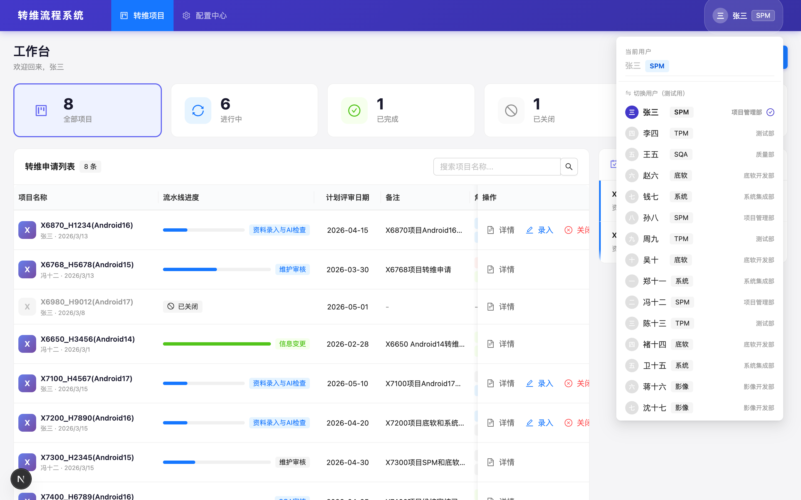

#### 5.1.3 布局分区

```
┌─────────────────────────────────────────────────────────────┐
│ [Logo 转维流程系统]   [转维项目] [配置中心]    [头像 姓名 ▼]│
└─────────────────────────────────────────────────────────────┘
```

- **Header 容器**：高 56px，`linear-gradient(135deg, #4338ca 0%, #3730a3 100%)`，阴影 `0 2px 12px rgba(67,56,202,0.35)`；`position: sticky, top: 0, z-index: 100`。
- **Logo**：白色文字"转维流程系统"，`font-size: 18px`，`letter-spacing: 2px`。点击回 `/workbench`。
- **主菜单**：Ant Design Menu（dark mode + 透明背景）两项：
  - `/workbench` → "转维项目"（图标 ProjectOutlined）
  - `/config` → "配置中心"（图标 SettingOutlined）
- **用户下拉触发器**：Avatar（36×36）+ 姓名 +角色 Tag（蓝色半透明）+ 下拉箭头；hover 时背景亮度提升。

#### 5.1.4 交互清单

| 元素 | 操作 | 效果 |
|------|------|------|
| Logo | 单击 | 导航到 `/workbench` |
| 菜单"转维项目" | 单击 | 导航到 `/workbench` |
| 菜单"配置中心" | 单击 | 导航到 `/config` |
| 用户下拉 | 单击 | 展开下拉，含当前用户信息 + 15 个用户列表 |
| 用户列表行 | 单击 | `switchUser(userId)`；下拉收起；当前页面不刷新，Context 自动更新 |

**下拉菜单结构：**
1. 不可点击 Label："当前用户"
2. 不可点击行：当前用户姓名 + 角色 Tag
3. 分隔线
4. 不可点击 Label："切换用户（测试用）"
5. 15 个用户行（可点击）：每行 Avatar（当前用户用主题色 #4338ca、其他用灰色）+ 姓名 + 角色 Tag + 部门；当前用户行尾带 ✓

#### 5.1.5 权限与可见性

- 顶栏对所有登录用户始终可见。
- 用户切换下拉无权限限制（mock 测试用途）。

#### 5.1.6 状态与边界

- 用户切换不清空任何页面状态（条目、筛选条件都会保留）。
- 页面刷新（F5）后用户重置为 u001（没有持久化）。
- 如果当前在 `/workbench/{id}/entry` 或 `/review`，切换成一个没有权限的用户，下一次操作时由各页面自己的权限判断决定按钮可见性；页面本身不会强制重定向。

---

### 5.2 工作台（首页 `/workbench`）

#### 5.2.1 功能定位

用户登录后的第一落地页。提供：转维申请清单、统计概览、关键词/状态筛选、新建申请入口、个人待办面板。

#### 5.2.2 截图


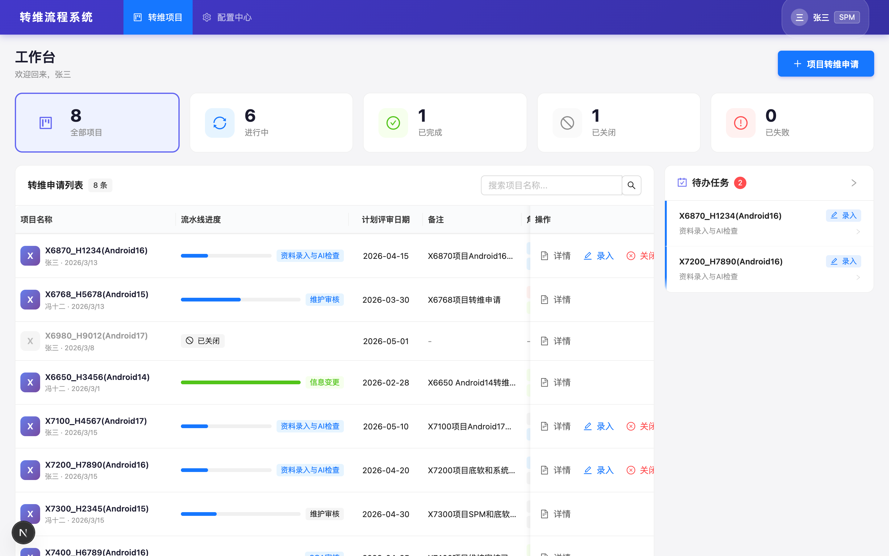

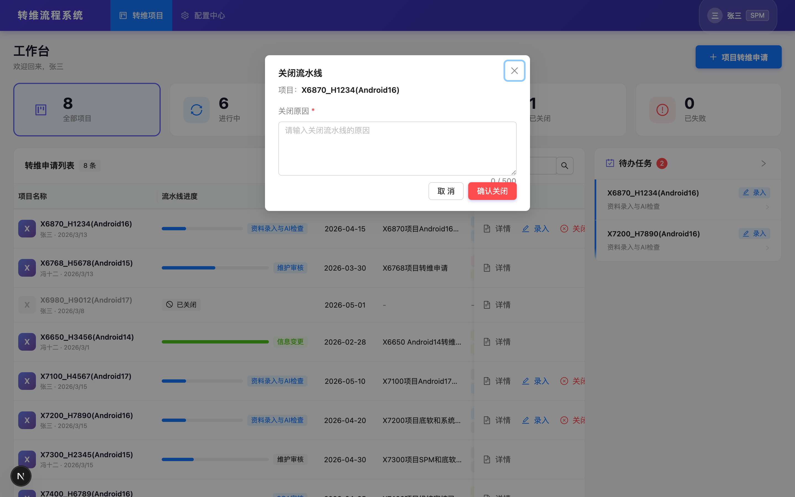

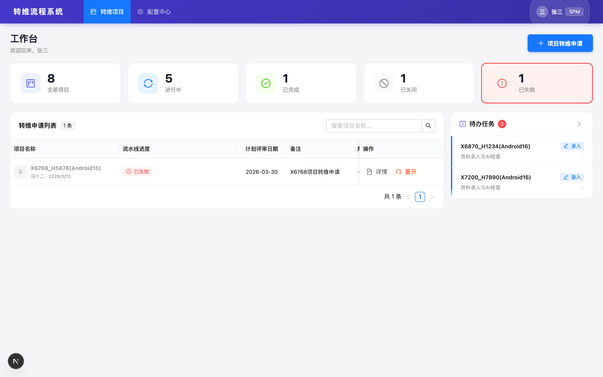

#### 5.2.3 布局分区

```
┌─────────────────────────────────────────────────────────────┐
│ 工作台                                [+ 项目转维申请]       │
│ 欢迎回来，{姓名}                                            │
├─────────────────────────────────────────────────────────────┤
│ [全部项目]  [进行中]  [已完成]  [已关闭]  [已失败]          │  ← 5 个统计卡
├─────────────────────────────────────────────────────────────┤
│ [🔍 搜索项目名称...]                                         │
├─────────────────────────────────────────────────────────────┤
│ 主表格（含分页）                                             │
│                                                              │
│                                                   ┌────────┐│
│                                                   │待办面板││← 右侧浮动
│                                                   └────────┘│
└─────────────────────────────────────────────────────────────┘
```

- **Page Header**：左标题 "工作台" + "欢迎回来，{currentUser.name}"；右侧主色按钮 "+ 项目转维申请"。
- **统计卡区**：横向 5 张卡，每张等宽；卡含图标、标题、数字、点击筛选态。
- **搜索栏**：单行 `Input.Search`，placeholder "搜索项目名称..."；按回车或失焦即筛选。
- **主表格**：占位宽度 100%，含分页；rowKey 为 application.id。
- **待办面板**：右侧浮动侧栏，默认折叠成窄条，点击展开；展开时遮挡表格最右列少量区域，但不遮挡操作列（表格操作列是 fixed right）。

#### 5.2.4 交互清单

##### A. 统计卡

| 卡片 | 图标 | 颜色 | 数字来源 | 点击效果 |
|------|------|------|----------|----------|
| 全部项目 | ProjectOutlined | #6366f1 | `applications.length` | `statusFilter = 'all'` |
| 进行中 | SyncOutlined | #1677ff | `filter(status==='in_progress').length` | `statusFilter = 'in_progress'` |
| 已完成 | CheckCircleOutlined | #52c41a | `filter(status==='completed').length` | `statusFilter = 'completed'` |
| 已关闭 | StopOutlined | #8c8c8c | `filter(status==='cancelled').length` | `statusFilter = 'cancelled'` |
| 已失败 | ExclamationCircleOutlined | #ff4d4f | `filter(status==='failed').length` | `statusFilter = 'failed'` |

- 当前激活卡片有**高亮边框**（主题色）+ 微阴影加强。
- 点击已激活的卡片会保持激活（不做 toggle 到 all）。
- 统计卡与搜索框的筛选**同时生效**（AND 关系）。

##### B. 主表格列

| 列 | 宽度 | 排序 | 筛选 | 渲染 |
|---|---|---|---|---|
| 项目名称 | 260 | — | — | Avatar（项目首字） + 项目名 + "发起人：{applicant}" + `updatedAt`；click → `/workbench/{id}` |
| 流水线进度 | 280 | — | — | `status=cancelled` 显示"已关闭"Tag；`failed` 显示"已失败"Tag + hover Tooltip 显示 `failureReason`；否则渲染 MiniPipeline 组件 |
| 计划评审日期 | 120 | ✅ | — | 原文字或 "-" |
| 备注 | 160 | — | — | Ellipsis + Tooltip |
| 角色进度 | 200 | — | — | `cancelled/failed` 显示 "-"；否则渲染 5 个 Tag（每个 PipelineRole 一个），颜色按 `entryStatus/reviewStatus` 组合：全完成 = 绿、任一驳回 = 红、任一进行中 = 蓝、其余 = 灰 |
| 操作 | 200 | — | — | 多个按钮（见 C）；`fixed: right` |

- **默认排序**：按 `updatedAt` 倒序（Context 层实现）。
- **行样式**：`status='cancelled'` 的行整体 `opacity: 0.5`，hover 时 `0.7`。
- **空态**：当前筛选下无行时显示 Ant Design 默认 Empty 插画 + 文案"暂无数据"。

##### C. 操作列按钮（6 种）

顺序：`详情` → `录入` → `评审` → `SQA审核` → `关闭` → `重开`

| 按钮 | 文案 | 颜色 | 图标 | 显示条件 | onClick |
|------|------|------|------|----------|---------|
| 详情 | 详情 | 灰 text | EyeOutlined | 始终显示 | 导航 `/workbench/{id}` |
| 录入 | 录入 | 蓝 text | FormOutlined | `isInProgress && (isInDataEntry ‖ hasRejectedRoleForUser) && (hasEntryRoleForUser ‖ isDelegatedEntryToUser)` | 导航 `/workbench/{id}/entry` |
| 评审 | 评审 | 绿 text | CheckSquareOutlined | `isInProgress && pipeline.maintenanceReview==='in_progress' && hasReviewRoleForUser` | 导航 `/workbench/{id}/review` |
| SQA审核 | SQA审核 | 可变（见下） | SafetyCertificateOutlined | `currentUser 是 SQA` 且（`pipeline.sqaReview==='in_progress'` 或 `maintenanceReview==='in_progress' && anyRoleRejected`） | 导航 `/workbench/{id}/sqa-review` |
| 关闭 | 关闭 | 红 text | StopOutlined | `isInProgress && pipeline.sqaReview!=='in_progress' && !anyRoleActivelyReviewing && 当前用户 === 申请人` | 打开关闭弹窗 |
| 重开 | 重开 | 橙 text #fa541c | RedoOutlined | `status==='failed' && !reopenedAsId && (项目在研 SPM ‖ 管理员)` | 导航 `/workbench/apply?from={id}` |

**SQA审核按钮颜色规则**：
- 正常进行中 + 全部角色已评审完：`#006d5b`（深绿，强调可以正常通过）
- 正常进行中 + 还有角色未完：`#faad14`（琥珀，提示在等维护审核）
- 驳回处理模式：`#ff4d4f`（红，警示风险）

##### D. 搜索 & 筛选

- **关键字**：对 `projectName` 做大小写不敏感的 `includes` 判定。
- **状态筛选**：与统计卡联动；刷新页面会重置为 `all`（无持久化）。
- **分页**：pageSize=10；页码组件在表格底部居中；跳页不重置筛选。

##### E. 待办面板

- **折叠态**：右侧 40px 宽侧栏，上方一个 BellOutlined + 未读徽标（当前所有用户待办数）。
- **展开态**：420px 宽卡片，顶部有标题 "我的待办"、关闭图标；列表展示当前用户的待办。
- **列表项**：
  - 类型 Tag（颜色见 §8.1）：`entry=蓝 / review=绿 / sqa_review=橙`
  - 项目名（主文本）
  - 节点（次文本，如 "资料录入" / "SPM 维护审核" / "SQA 审核"）
  - 点击整行 → 跳转对应页面（`entry/review/sqa-review`）
- **过滤规则**：`todo.responsiblePerson === currentUser.name` 且 `application.status === 'in_progress'`（已关闭/失败/完成的不显示）。
- **空态**：ClockCircleOutlined 大图 + "暂无待办任务" + 辅助文案 "所有任务都处理完了，继续保持！"

##### F. 关闭申请弹窗

**触发：** 点击操作列"关闭"。

**结构：**
- **标题**："确认关闭转维流程"
- **内容**：
  - 当前项目名展示（Descriptions 单行）
  - 如果任意角色已进入过评审（`reviewStatus != 'not_reviewed'`），显示 5 列小表：角色 / 责任人 / 评审结论 Tag / 评审意见
    - 结论 Tag：未开始=灰、进行中=蓝、通过=绿、驳回=红
  - TextArea "关闭原因"：必填、showCount、maxLength=500、placeholder "请说明本次关闭流水线的原因（必填）"
- **按钮**："取消" / "确认关闭（红色 danger）"
- **宽度**：有评审表时 640px，否则 480px

**交互：**
- 点"确认关闭"时：若原因为空 → toast warning "请填写关闭原因"，不关闭弹窗；否则调用 `updateApplication({ status: 'cancelled', cancelReason })`，toast success "流水线已关闭"，关闭弹窗，页面自动刷新列表。
- 点"取消"或右上 X：关闭弹窗，已输入原因丢弃。

#### 5.2.5 权限与可见性

已在表 C 中详述。核心原则：**动作按钮仅对"有权做"的用户显示**，而不是禁用。

#### 5.2.6 状态与边界

- 一条申请**同时只能有一个用户点击某个动作**，前端不做并发锁（mock 无后端），但后续接入后端后此处应加乐观锁或轮询。
- `cancelled` 和 `failed` 的申请整行保留可见，只是 opacity 降低；不会自动隐藏。
- 搜索+筛选后无结果时，5 个统计卡的数字**仍显示全量**（统计不受筛选影响）。

---

### 5.3 新建转维申请 / 重开（`/workbench/apply`）

#### 5.3.1 功能定位

两种模式合一的表单页：
- **新建模式**（默认）：选项目 → 分配 5 个 Pipeline Role 的在研+维护人员 + SQA → 填写计划评审日期 + 备注 → 提交。
- **重开模式**（`?from={sourceAppId}`）：在某个 `failed` 申请基础上重新发起，锁定项目、自动回填原人员分配，提交后新申请继承原申请的已录入内容。

#### 5.3.2 截图

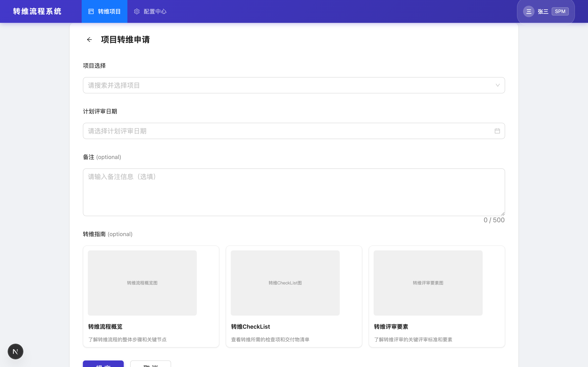

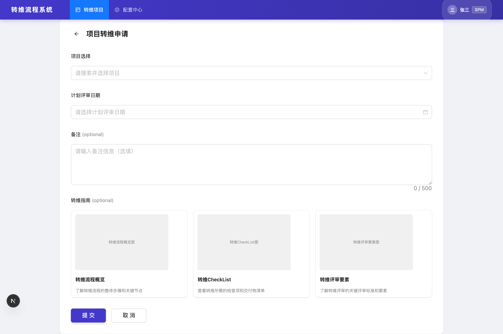

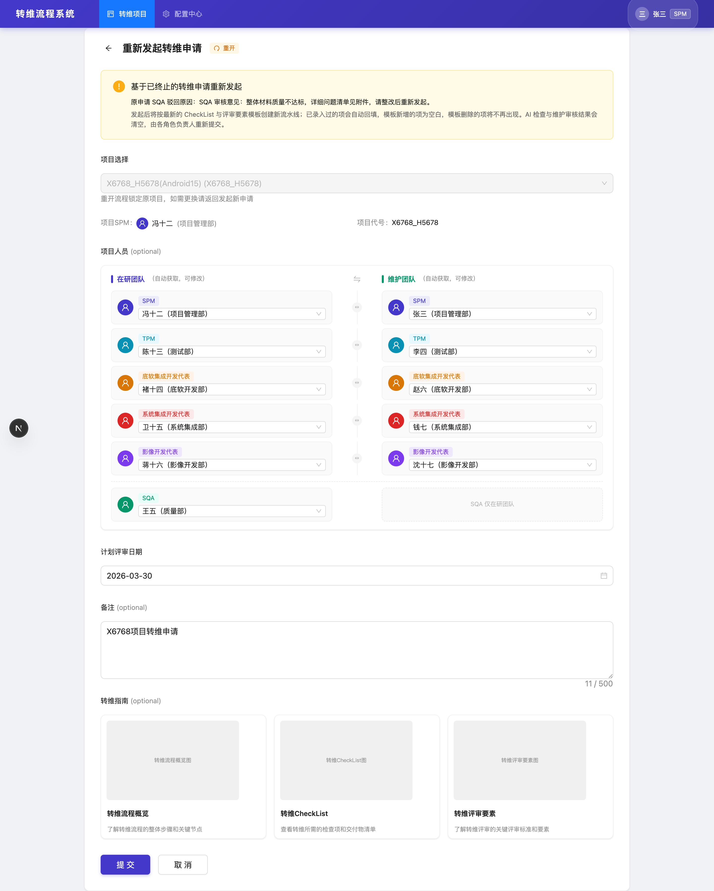

#### 5.3.3 布局分区

```
┌─ [← 返回] 项目转维申请（或"重新发起转维申请" [重开]Tag）
├─────────────────────────────────────────────────────────────
│ （重开模式下：警示横条 Alert）
├─ 项目选择（Select）
├─ 项目 SPM 信息（Descriptions readonly）
├─ 项目人员（2 列配对布局：在研 ← → 维护；含 SPM/测试/底软/系统/影像+SQA）
├─ 计划评审日期（DatePicker）
├─ 备注（TextArea）
├─ [取消]  [提交]
└─────────────────────────────────────────────────────────────
     ┌────────────────────────┐
     │ 侧边指引卡（流程 / CheckList / 评审要素）
     └────────────────────────┘
```

#### 5.3.4 交互清单

##### A. URL Query Param

- 无参数 → 新建模式
- `?from={appId}` → 重开模式；若 `sourceApp` 不存在、或 `reopenedAsId` 已被占用、或当前用户非项目 SPM/管理员 → 显示"访问受限"提示页（带返回按钮）。

##### B. Header

- 返回箭头（左上）：回 `/workbench`
- 标题：新建 = "项目转维申请"；重开 = "重新发起转维申请" + 橙色 Tag"[重开]"

##### C. 重开模式 Alert

**显示位置：** 标题下方横跨整行。

**样式：** `type=warning, showIcon, icon=InfoCircleOutlined`

**内容：**

> 基于已终止的转维申请重新发起
> 原申请 ID：`{sourceApp.id}`
> 原失败原因：{SQA 的 failureReason}
> 发起后将按最新的 CheckList 与评审要素模板创建新流水线；已录入过的项会自动回填（如模板已变动，则仅保留匹配条目），AI 检查会自动对已录入条目重新运行。

##### D. 表单字段

###### D.1 项目选择

- **控件：** Select（可搜索）
- **必填：** ✅；校验失败 toast "请选择项目"
- **选项源：** `MOCK_PROJECTS` 过滤掉当前已有 `status in ['in_progress','completed']` 的 projectId
- **重开模式：** disabled，值锁定为源 `projectId`；extra 文案 "重开流程锁定原项目，如需更换请返回发起新申请"
- **onChange：** 调用 `handleProjectChange(projectId)` → 拉取项目基础信息 + 默认项目 SPM + 清空团队成员
- **allowClear：** 新建=true；重开=false

###### D.2 项目 SPM 信息

- **控件：** Descriptions（只读），2 列
- **字段：** 头像 / 姓名 / 部门 / 项目编号
- **显示条件：** 选中项目后才渲染

###### D.3 项目人员

**布局：** 自定义 2 列配对。左列"在研团队"，右列"维护团队"。每行一个 PipelineRole，行内组件：**Avatar + 角色 Tag + Select**。

**配对关系（PAIRED_ROLES）：** SPM / 测试 / 底软 / 系统 / 影像 → 在研×维护各 1 人共 2 个 Select。

**SQA 行：** 仅在在研列渲染，维护列为 em-dash "—"。

**MemberSelect 组件细节：**
- **选项源：** `MOCK_USERS.filter(u => u.role 匹配当前 PipelineRole 且 u.id 不在已选 usedIds 内（或等于当前已选））`
- **选项格式：** `{name}（{dept}）`
- **单选；必填；** 空值时 submit 会校验失败 toast "请为所有角色分配人员"

**约束：**
- 同一用户不能在同一列（或跨列）重复分配
- 重开模式下所有 Select 自动填入源申请的分配，用户可修改（但项目 SPM 位置的用户仍然由项目决定，不可换）

###### D.4 计划评审日期

- **控件：** DatePicker（日期粒度）
- **格式：** YYYY-MM-DD
- **必填：** ✅
- **约束：** 不允许选择今天之前的日期；placeholder "请选择计划评审日期"

###### D.5 备注

- **控件：** TextArea（rows=4, showCount, maxLength=500）
- **选填；** placeholder "可输入本次转维的补充说明"

##### E. 提交行为

点击"提交"：
1. 表单校验。任一字段失败则 toast warning 并高亮对应字段。
2. `setSubmitting(true)`，按钮显示 loading 动画。
3. 模拟 800ms 延迟（mock）。
4. 组装 `newApp: TransferApplication`：
   - `id: 'app-{Date.now()}'`
   - `status: 'in_progress'`
   - `pipeline.projectInit: 'success'`（立即跳过）
   - `pipeline.dataEntry: 'in_progress'`
   - 其余 pipeline 节点 `not_started`
   - `roleProgress`: 5 个 Pipeline Role，每个 `entryStatus: 'not_started', reviewStatus: 'not_started'`
   - `createdAt/updatedAt: now()`
   - 重开模式下：`predecessorId: sourceApp.id`
5. 根据模式分发：
   - 新建：`addApplication(newApp)` → toast success "转维申请提交成功！"
   - 重开：`reopenApplication(sourceApp.id, newApp)`（内部完成条目回填 + 自动 AI 检查）→ toast success "转维申请已重新发起，之前录入的内容已保留"
6. 成功后 `router.push('/workbench')`。
7. 失败兜底：toast error "提交失败，请重试"，`setSubmitting(false)`。

##### F. 取消按钮

- 无二次确认，直接 `router.push('/workbench')`。
- 重开模式下取消不会影响源申请（源申请状态不变）。

##### G. 侧边指引卡（3 张）

每张卡展示一个小插画 + 标题 + hover 文案"点击预览"。当前点击无实际效果（placeholder），未来接入产品知识库。

- **流程概览**：整体 5 阶段速览
- **CheckList**：模板说明
- **评审要素**：模板说明

#### 5.3.5 权限与可见性

- **新建模式：** 任何登录用户都能访问；提交后 `applicantId = currentUser.id`。
- **重开模式：** 只有源申请的项目在研 SPM 或管理员可访问；非法访问显示 guard 页："只有该项目的 SPM 或系统管理员可以重新发起转维申请"或"该申请已被重新发起过，不能再次重开"。

#### 5.3.6 状态与边界

- 新申请 ID 采用时间戳，同秒内发起两次可能冲突（mock 层不严格）。
- 计划评审日期无强校验（不会与当前日期做复杂校验）。
- 重开后源申请 `reopenedAsId` 写入，工作台详情页 banner 文案变为"本申请已重新发起新的转维流程"，且列表/详情的重开按钮隐藏。

---

### 5.4 详情页（`/workbench/{id}`）

#### 5.4.1 功能定位

一个申请的**全量视图**。所有信息聚合：管道、团队、两类条目清单、Block/遗留任务、历史记录。该页不提供修改能力（除 SQA 驳回后 banner 里的"重开"按钮外），修改动作通过跳转到对应子页完成。

#### 5.4.2 截图


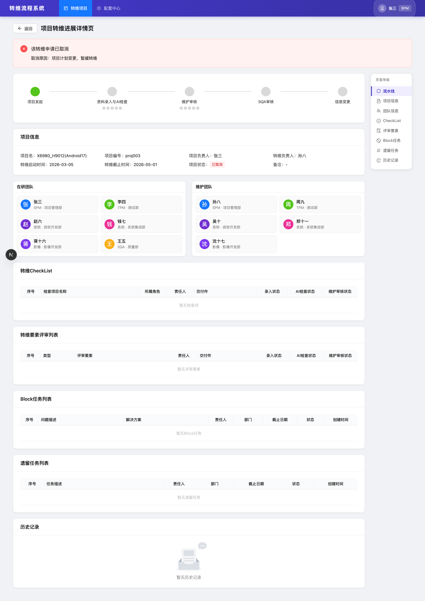

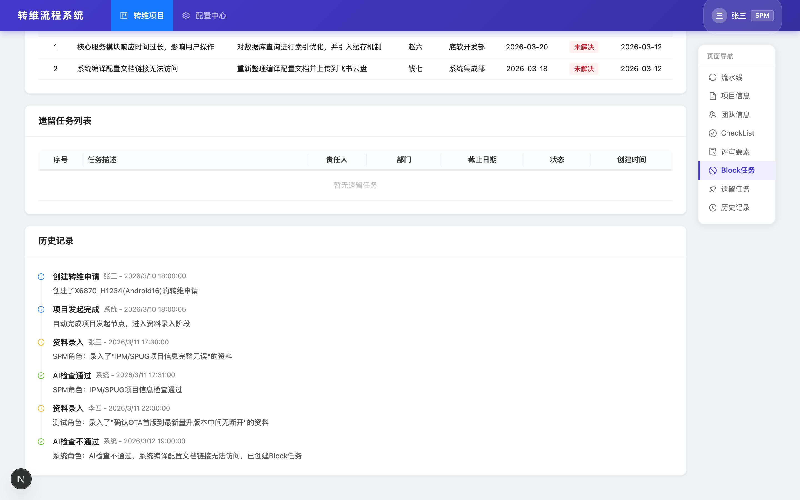

#### 5.4.3 布局分区

```
┌─ [← 返回] 项目转维进展详情页
├───────────────────────────────────────────┬──────────┐
│                                           │          │
│ (状态 Banner - 条件显示)                  │ 浮动锚点 │
│ [pipeline]                                │ section1 │
│ [项目信息]                                │ section2 │
│ [在研团队] [维护团队]                     │ ...      │
│ [转维 CheckList]                          │          │
│ [转维要素评审列表]                        │          │
│ [Block 任务列表]                          │          │
│ [遗留任务列表]                            │          │
│ [历史记录]                                │          │
└───────────────────────────────────────────┴──────────┘
```

- **左主区**：`flex: 1`，从上到下 8 个 section，每个 section 有 `id="section-xxx"` 供锚点定位。
- **右浮动锚点**：`position: sticky, top: 80px`，宽 140px；8 个锚点项。

#### 5.4.4 交互清单

##### A. 返回按钮

- 图标 LeftOutlined，灰 text；点击回 `/workbench`。

##### B. 状态 Banner

**触发与文案：**

| 条件 | Banner 类型 | 内容 |
|------|------------|------|
| `status === 'cancelled'` | error | 标题 "该转维申请已取消" + "取消原因：{cancelReason}" |
| `status === 'failed'` | error | 标题 "SQA 审核未通过，转维流程已终止" + "SQA 评审意见：{failureReason}" + 尾部行为（见下） |

**failed 状态下的尾部行为：**
- `reopenedAsId` 存在：显示次文 "本申请已重新发起新的转维流程"（灰字 13px）。
- `reopenedAsId` 不存在 且 当前用户是项目 SPM 或管理员：显示主按钮 "重新发起转维申请"（红色 type=primary danger），点击 → `/workbench/apply?from={id}`。
- 以上都不满足：显示次文 "如需重新发起，请联系该项目的 SPM 或系统管理员"。

##### C. Pipeline 区（section-pipeline）

- 渲染 `<PipelineProgress showRoleDots={true} />` 组件
- 组件结构：5 个节点横向排列；节点间有连接线；节点下方显示节点名；数据录入和维护审核两个节点下方额外显示 5 个角色小圆点。
- 节点色：not_started=#d9d9d9、in_progress=#1677ff、success=#52c41a、failed=#ff4d4f。
- 角色圆点色按 RoleNodeStatus：not_started=灰、in_progress=蓝、completed=绿、rejected=红；hover tooltip 显示 "{role}: {status 中文}"。

##### D. 项目信息区（section-info）

- **控件：** Descriptions（2 列）
- **字段：**
  - 项目名称
  - 项目编号
  - 申请人
  - 转维负责人（= 在研 SPM）
  - 启动时间（`createdAt` 格式化）
  - 截止时间（`plannedReviewDate`）
  - 状态（带 Tag）
  - 备注

##### E. 团队区（section-team）

- 两张卡并排："在研团队" / "维护团队"
- 每卡内 2 列 grid 展示 TeamMemberCard：Avatar + 姓名 + 角色 Tag + 部门
- 排序：SPM→TPM→底软→系统→影像→SQA（仅在研团队含 SQA）

##### F. 转维 CheckList（section-checklist）

- **控件：** Table，ellipsis + tooltip 长内容
- **列：** seq / type / checkItem / responsibleRole / entryPerson / deliverables (EntryContentRenderer 解析链接) / entryStatus / aiCheckStatus / reviewStatus
- **Tag 可点击：**
  - `aiCheckStatus === 'failed'` 的 Tag 可点击 → 弹窗显示 `aiCheckResult`
  - `reviewStatus === 'rejected'` 的 Tag 可点击 → 弹窗显示 `reviewComment`
- **弹窗结构：** 标题 "AI 检查详情" / "评审意见"；内容 `<pre>` 格式；只有一个"关闭"按钮

##### G. 转维要素评审列表（section-review）

同 CheckList 结构，列字段换成 `standard / description / remark`（`checkItem` → `standard + description + remark` 三字段）。

##### H. Block 任务（section-block）

- **表格列：** seq / description / resolution / responsiblePerson / department / deadline / status Tag / createdAt
- **status 颜色：** open=红 / resolved=绿 / cancelled=灰

##### I. 遗留任务（section-legacy）

- 同 Block，但 open=橙色（表达"还没解决但不阻塞"）

##### J. 历史记录（section-history）

- **控件：** Timeline，每条含 icon + 标题 + 元信息行（"{operator} · {timestamp}"）+ detail
- **icon 色映射：**
  - 创建/申请 = 蓝 PlusCircleOutlined
  - 通过/成功 = 绿 CheckCircleOutlined
  - 驳回/失败 = 红 CloseCircleOutlined
  - 录入 = 黄 EditOutlined
  - 其他 = 灰 ClockCircleOutlined

##### K. 浮动锚点导航

- 垂直排列 8 项：pipeline / 项目信息 / 团队 / CheckList / 评审要素 / Block / 遗留 / 历史
- 点击：平滑滚动到对应 section（`scrollIntoView({behavior: 'smooth', block: 'start'})`）
- 激活态：当前可视区域的 section 对应的锚点加粗、主色文字 #4338ca、左侧 3px 蓝竖线、`background: #f0edff`
- 激活逻辑：IntersectionObserver 计算当前 viewport 顶部下 150px 处落在哪个 section

#### 5.4.5 权限与可见性

- 详情页对所有人只读，不区分权限。
- 仅 SQA 驳回 banner 里的"重新发起转维申请"按钮受权限控制。

#### 5.4.6 状态与边界

- `id` 无效 → 显示 Empty "未找到转维申请"+ 返回按钮。
- 各 section 无数据时：
  - CheckList / 评审要素：显示 Empty "暂无条目"
  - Block / 遗留：显示 Empty + 辅助文案"暂无任务"
  - 历史：显示 Empty "暂无操作记录"
- 长内容（checkItem / standard / deliverables）一律 ellipsis + Tooltip。

---

### 5.5 资料录入与 AI 检查（`/workbench/{id}/entry`）

#### 5.5.1 功能定位

在研团队成员在此填入 CheckList 材料和评审要素的内容，提交后触发 AI 预检，全部通过后可提交到维护审核。支持任务委派、草稿暂存、批量导入导出。

#### 5.5.2 截图

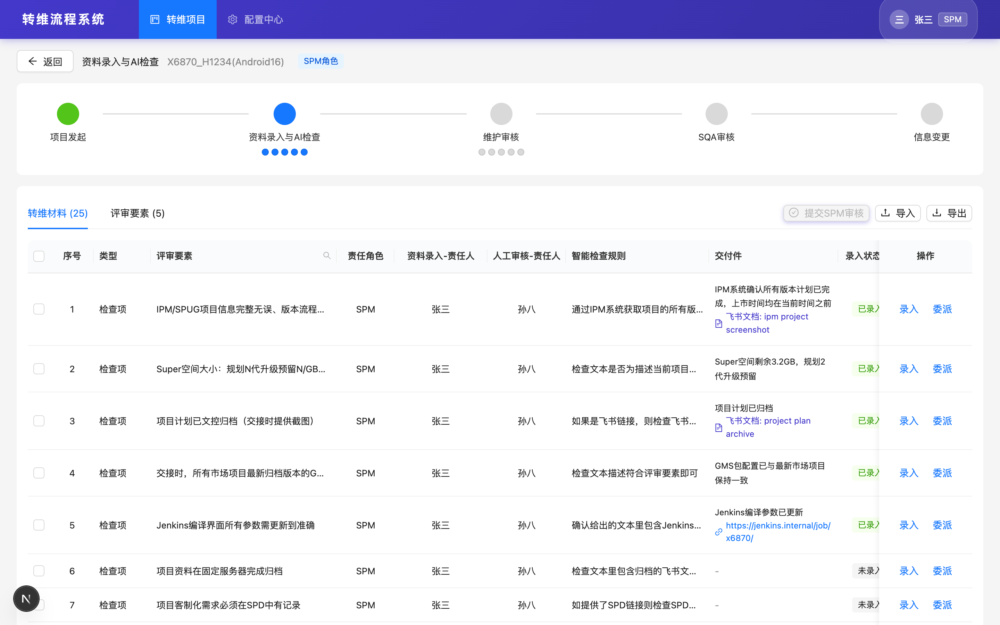


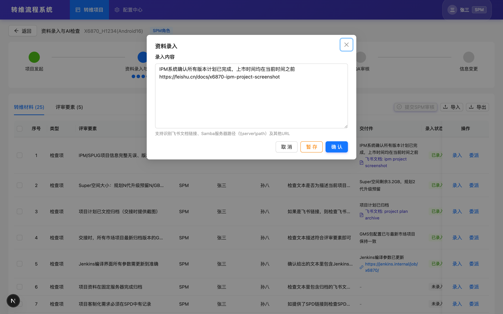

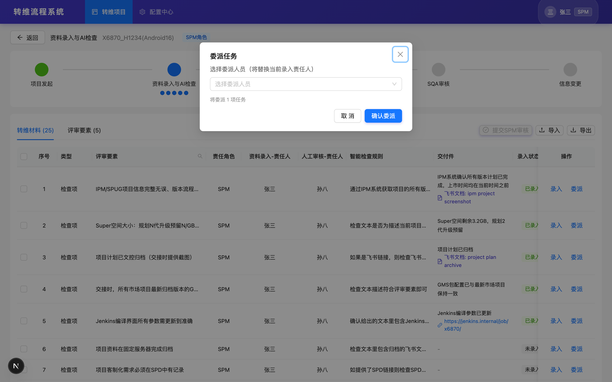

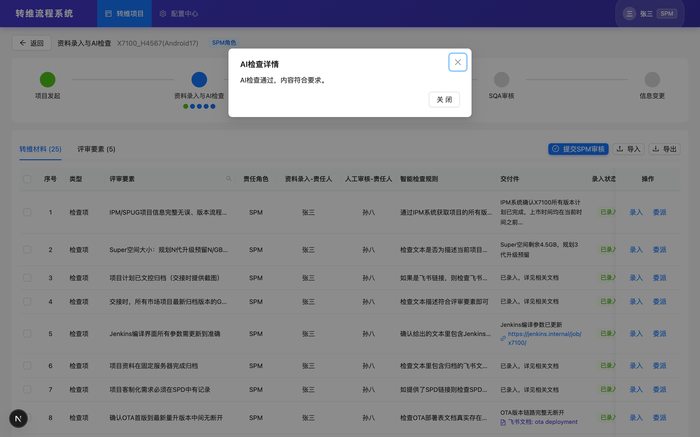

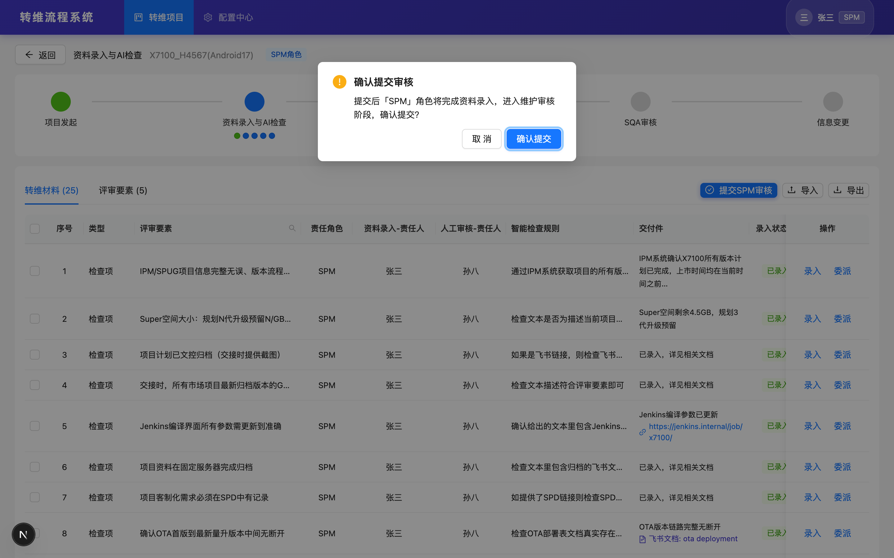

#### 5.5.3 布局分区

```
┌─ [← 返回] 资料录入与AI检查 ⋄ {projectName}  (角色选择: Segmented 或 Tag)
├── PipelineProgress
├── (条件) 驳回 Block Alert
├─ Tabs: 转维材料 | 评审要素
│        右上 Tab Extra: [全部委派(n)] [提交{角色}审核] [导入] [导出]
│
│   [主表格] ...
│   [折叠：委派给我的条目]
└────────────────────────────────────────────────────────
```

#### 5.5.4 交互清单

##### A. 访问 guard

- 如果 `application.status !== 'in_progress'`：页面中部显示 Alert：
  - cancelled → "该申请已取消，无法进行录入"
  - failed → "SQA 审核未通过，流程已终止"
  - completed → "转维流程已完成"
- Alert 下方放"返回工作台"按钮。

##### B. 顶部头部

- 左：返回箭头 + "资料录入与AI检查" 标题 + 项目名（灰色）
- 右：**角色选择器**
  - 当前用户（在研 or 被委派）有多个角色时：Segmented（分段控件）列出可选角色，点击切换视图
  - 只有单一角色：角色 Tag（不可切换）
  - 切换时：清空已勾选行、切换表格数据源

##### C. Pipeline 区

仅渲染 `<PipelineProgress showRoleDots={false} />`（简化版，不展示角色圆点）。

##### D. 驳回 Block Alert

**显示条件：** `currentEffectiveRole` 所属的 Pipeline Role 中至少一个条目 `reviewStatus === 'rejected'` **且** 至少一个 `BlockTask.status === 'open'` 归属当前角色。

**内容：**
- `type=error, showIcon`
- 标题 "维护审核驳回，请根据以下 Block 任务整改后重新提交"
- 列表形式展示每条 open 的 Block：description / responsiblePerson / deadline

##### E. Tabs（2 个）

- **转维材料**（checklist）
- **评审要素**（review elements）

**TabBar Extra Content（右侧操作区）：**

| 按钮 | 显示条件 | 动作 |
|------|----------|------|
| 全部委派（n） | `selectedRowKeys.length > 0` | 打开"批量委派"弹窗，更新所选行的 `entryPerson` 为目标用户，并追加到 `delegatedTo` |
| 提交{角色}审核 | 始终显示（可 disable） | 见 H：提交审核确认流 |
| 导入 | 始终显示 | 打开文件选择；完成后 toast success "导入成功"（本期 mock） |
| 导出 | 始终显示 | 下载 CSV；toast success "导出成功，文件已下载"（本期 mock） |

##### F. 主表格列（以 Checklist 为例，12 列）

| 列 | 搜索 | 筛选 | 备注 |
|---|---|---|---|
| seq | — | — | 序号 |
| type | — | — | "检查项" / "交接资料" |
| checkItem | ✅（`useColumnSearch`） | — | ellipsis + Tooltip |
| responsibleRole | — | — | 显示 PipelineRole 名称 |
| entryPerson | — | — | 姓名；若被委派则追加"已委派"小 Tag |
| reviewPerson | — | — | 维护侧负责人 |
| aiCheckRule | — | — | ellipsis + Tooltip |
| deliverables | — | — | EntryContentRenderer 解析 entryContent 中的飞书/Samba/URL 链接 |
| entryStatus | — | ✅ 3 值 | Tag 色：not_entered=灰、draft=橙、entered=绿 |
| aiCheckStatus | — | ✅ 4 值 | Tag 可点击（非 not_started 时） |
| reviewStatus | — | — | Tag 可点击（rejected 时）→ 显示 `reviewComment` |
| 操作 | — | — | "录入" text 按钮 + "委派" text 按钮 |

**评审要素 Tab** 列结构类似，字段差异：`type/checkItem` → `standard/description/remark`。

##### G. 委派给我的条目（折叠区）

**显示条件：** 当前用户名在其他角色的 `delegatedTo[]` 列表里（来自别人委派给我）。

**渲染：**
- Collapse 默认关闭
- 标题 "委派给我的转维材料（{count}）（来自其他角色的委派任务，不影响本角色提交审核）"
- 展开后表格**只读**：可以看内容但没有操作列；也不能被勾选
- 作用是让被委派人知道"别的角色也等我帮忙"

##### H. 提交{角色}审核

**可用条件（`canSubmitReview`）：**
- `effectiveRole` 已选
- 当前角色的 **所有 CheckList** 和 **所有 ReviewElement** 都满足：`entryStatus === 'entered' && aiCheckStatus === 'passed'`
- 至少存在 1 条该角色的条目

**Disabled 时 hover Tooltip：** "仍有未完成录入或 AI 检查未通过的条目"

**点击流：**
1. `Modal.confirm`：标题 "提交审核"；内容 "提交后「{role}」角色将完成资料录入，进入维护审核阶段，确认提交？"
2. 确认：
   - 对当前角色所有条目设置 `reviewStatus='reviewing'`
   - 当前 Pipeline Role 的 `entryStatus='completed'`
   - 触发 Context 自动推导：若所有角色 `entryStatus==='completed'` → `pipeline.dataEntry='success'` → `maintenanceReview='in_progress'`
   - toast success "「{role}」角色已提交维护审核"
   - `router.push('/workbench/{id}')`

##### I. 录入弹窗

**触发：** 点击行"录入"按钮。

**结构：**
- 标题 "资料录入"
- 上方显示条目上下文：type / checkItem / aiCheckRule（只读 Descriptions）
- TextArea "录入内容"：rows=8、`showCount` 不强制但建议输入；placeholder "请输入资料内容，支持粘贴飞书文档链接、Samba路径或其他URL..."
- Helper 文案 "支持识别飞书文档链接、Samba 服务器路径（\\\\server\\path）及其他 URL"
- 按钮三选：
  - 取消（默认按钮）
  - 暂存（橙色边框 `borderColor: #fa8c16`）：`entryStatus='draft'`、`aiCheckStatus='not_started'`
  - 确认（primary）：`entryStatus='entered'`、`aiCheckStatus='in_progress'` → 启动 `simulateAiCheck`

**校验：**
- 内容必填（trim 后非空）。为空时 toast warning "请输入内容"。

**Toast：**
- 暂存成功 → "已暂存"
- 确认成功 → "已确认提交，AI检查进行中..."

##### J. 委派弹窗

**触发：** 单条"委派"按钮（单条委派）或 Tab 右上"全部委派"按钮（批量委派）。

**结构：**
- 标题 "委派任务"
- Select：过滤 `MOCK_USERS` 排除当前用户，格式 "{name}（{role} - {dept}）"
- 当前选中条目列表（单行或多行）readonly 摘要

**确认行为：**
- 未选目标人 → toast warning "请选择委派人员"
- 选中后：更新 `entryPerson/entryPersonId` 为目标人；向 `delegatedTo` 数组追加目标用户 ID（用于追溯）；toast success "已委派给 {name}，录入责任人已更新"

##### K. AI 检查详情弹窗

**触发：** 点击 `aiCheckStatus` Tag（非 not_started）。

**结构：**
- 标题 "AI 检查详情"
- 内容 `<pre>` 格式展示 `aiCheckResult`；若无 result（如 in_progress），显示 "AI 检查进行中..."（passed）/ "AI 检查通过，内容符合要求。"（兜底）

##### L. AI 检查模拟

- 延迟：`1000 + Math.random() * 1000` ms
- 通过率：`Math.random() > 0.1`（90%）
- 通过文案：`AI 检查通过，内容符合要求。` + toast success "AI 检查通过"
- 失败文案：`AI 检查不通过，请检查内容是否完整或链接是否有效。` + toast error "AI 检查不通过，请修改后重新提交"

**静默模式（重开触发时）：** 同样的延迟与概率，但**不发送 toast**，因为重开是后台批量操作。

#### 5.5.5 权限与可见性

- **谁能进入此页：** 任何登录用户都能导航到 URL，但只有满足"工作台→录入按钮"显示条件的用户能在工作台看到入口。直接输入 URL 不做强校验（页面只根据当前用户推导 `effectiveRole`，无效则显示"当前用户无录入权限"提示）。
- **谁能看到自己的委派条目：** 当前用户名出现在 `item.delegatedTo[]` 中时。

#### 5.5.6 状态与边界

- 关闭 / 失败 / 完成申请：页面渲染 guard 态，不可录入。
- 录入弹窗关闭时未保存 → 内容丢弃；重新打开显示上次已保存内容。
- AI 检查进行中时再次编辑内容：重新进入 `in_progress`，旧结果被清除。
- 委派是"追加"语义：再次委派给另一个人，原 `delegatedTo` 仍保留（用于历史追溯），只是 `entryPerson` 指向最新的。
- 多角色用户：切换 Segmented 时只切换表格数据源，Tab 选中状态保持（转维材料 vs 评审要素）。
- 导入导出当前为 mock：不做真实文件解析。

---

### 5.6 维护审核（`/workbench/{id}/review`）

#### 5.6.1 功能定位

维护团队某角色成员对该角色的 CheckList 和评审要素做审核，单条/批量/角色级通过或驳回；驳回时创建 Block 任务，通过时可附带遗留任务。

#### 5.6.2 截图

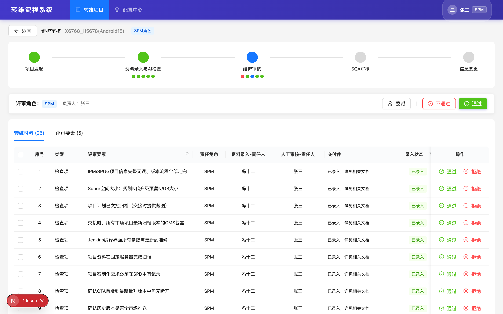

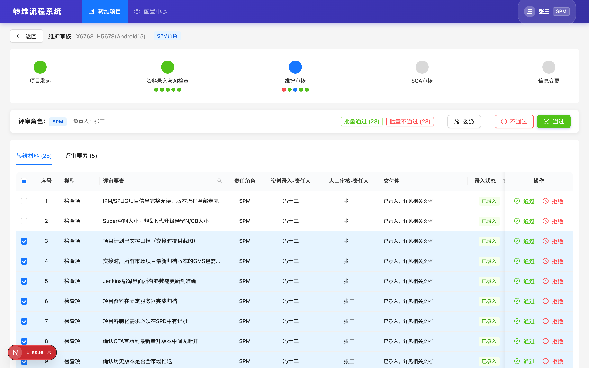

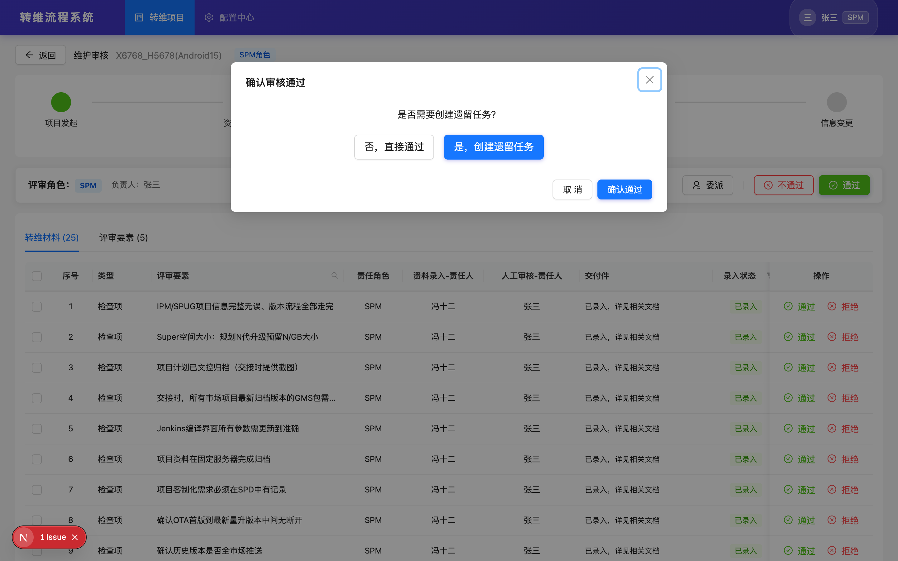

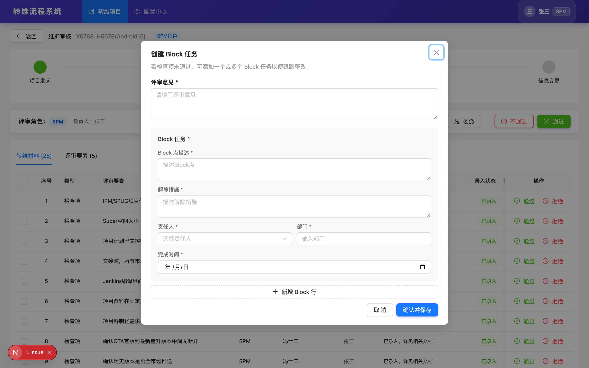

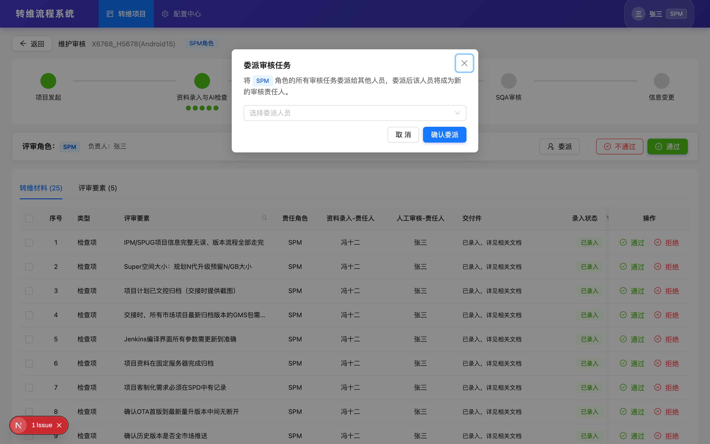

#### 5.6.3 布局分区

```
┌─ [← 返回] 维护审核 ⋄ {projectName}   [当前角色：{role}]
├── PipelineProgress
├── Sticky 操作栏：
│   - 左：角色 + 委派状态 + 审核元信息
│   - 右：[全部委派] [角色驳回] [角色通过] （行选中时多出 [批量驳回] [批量通过]）
├── Tabs：转维材料 | 评审要素
│   [行选择主表格]
└─────────────────────────────────
```

#### 5.6.4 交互清单

##### A. 头部

- 返回 + "维护审核" 标题 + 项目名 + 当前角色 Tag（维护侧角色）
- 无角色切换器（维护审核角色由团队分配决定，不可自选）

##### B. Sticky 操作栏（核心）

- **背景**：白底 + 阴影，top: 56px（紧贴 Header 下方）
- **左**：当前角色 + 委派状态（若 `delegatedTo` 非空，显示"已委派给 {userList}"）
- **右**：操作按钮组（条件可见）

| 按钮 | 显示条件 | 动作 |
|------|----------|------|
| 批量通过 | `selectedRowKeys.length > 0` | 单次调用 `handleBatchReview('passed')`，对所有选中项设 reviewStatus=passed；toast "批量通过 {n} 条记录" |
| 批量驳回 | `selectedRowKeys.length > 0` | 同上，reviewStatus=rejected + aiCheckStatus=not_started；toast "批量不通过 {n} 条记录" |
| 全部委派 | 始终显示 | 打开角色级委派弹窗 |
| 角色驳回 | 始终显示 | 打开"驳回"弹窗（含评审意见 + Block 任务） |
| 角色通过 | 始终显示 | 打开"通过"弹窗（含可选遗留任务） |

##### C. 表格

- 行选择（Checkbox），支持全选/反选
- 其他列同详情页 CheckList 渲染，但每行最右边有两个 text 按钮：
  - "通过"（绿）→ 单条 `handleItemReview(id, 'passed')`
  - "驳回"（红）→ 单条 `handleItemReview(id, 'rejected')`（不弹窗，直接打标；但整个角色的驳回要通过"角色驳回"弹窗提交评审意见）

##### D. 通过弹窗

**标题：** "审核通过"

**内容：**
- 确认文案 "确认通过「{role}」角色的全部条目？"
- 提醒 "如有需要后续跟进的遗留事项，可在下方添加"
- **遗留任务列表**（可动态添加多行，每行删除按钮）：
  - description（必填）
  - responsiblePerson（必填，选 MOCK_USERS）
  - department（随 responsiblePerson 自动带入）
  - deadline（DatePicker，必填）
- 加号按钮"+ 添加遗留任务"

**校验：** 任一已添加行有空字段 → toast warning "请填写完整所有遗留任务信息"，不提交。

**确认行为：**
- 当前角色所有条目 `reviewStatus='passed'`
- 本轮添加的遗留任务追加到 `application.legacyTasks`
- roleProgress 当前角色 `reviewStatus='completed'`
- 若所有角色都 completed → `maintenanceReview='success'` → `sqaReview='in_progress'`（Context 自动推导）
- toast success "审核通过，已提交"
- `router.push('/workbench/{id}')`

##### E. 驳回弹窗

**标题：** "审核驳回"

**内容：**
- 必填 TextArea "评审意见"（占位 "请填写评审意见"，无长度上限）
- **Block 任务列表**：与通过弹窗的遗留任务结构相同（description/responsiblePerson/department/deadline），但字段名是 block
- 加号按钮"+ 添加 Block 任务"

**校验：**
- 评审意见必填 → toast warning "请填写评审意见"
- 任一 Block 行有空字段 → toast warning "请填写完整所有 Block 任务信息"

**确认行为：**
- 当前角色所有条目 `reviewStatus='rejected'`，并把评审意见写到每条的 `reviewComment`
- 当前角色所有条目 `aiCheckStatus='not_started'`（强制重走 AI 检查）
- 当前角色 roleProgress.reviewStatus='rejected'，entryStatus 回到 in_progress
- 创建 Block 任务并追加到 `application.blockTasks`
- `pipeline.maintenanceReview` 保持 in_progress（因为还有其他角色可能已通过）
- 若此时 `pipeline.sqaReview === 'not_started'`：自动提前进入 `in_progress`（SQA 驳回处理模式）
- toast success "已拒绝并创建 Block 任务，已回退到资料录入阶段"
- `router.push('/workbench/{id}')`

##### F. 单条通过/驳回

- 不弹窗，直接调用 Context API 更新单条 `reviewStatus`
- toast "已通过" / "已标记为不通过"
- 驳回单条时同样清空该条的 `aiCheckStatus`

##### G. 委派弹窗（角色级）

- 选一个维护侧用户接收本角色的审核任务
- 更新 `reviewPerson/reviewPersonId` + `delegatedTo`
- toast "已将「{role}」角色的审核任务委派给 {name}"

#### 5.6.5 权限与可见性

- **访问：** 当前用户是申请的维护团队成员**且**自己角色的 `reviewStatus === 'reviewing'`
- 不是维护侧成员直接打 URL → 显示 "当前用户无评审权限" 提示页

#### 5.6.6 状态与边界

- **角色驳回后**：本角色条目回退到录入阶段，在研侧的该角色用户在工作台会再次看到"录入"按钮。
- **并行角色独立**：一个角色的驳回不影响其他角色已通过的记录（但会触发 SQA 进入驳回处理模式）。
- 关闭/失败/完成申请时 guard 提示。
- 批量操作的行选择与 Tab 切换解耦：切 Tab 会清空选择。

---

### 5.7 SQA 审核（`/workbench/{id}/sqa-review`）

#### 5.7.1 功能定位

SQA 作为流水线质量终审。两类进入场景：
1. **正常通过路径**：`maintenanceReview` 全部完成 → `sqaReview` 变 in_progress → SQA 审核通过（→ 信息变更）或驳回（→ `status=failed`）
2. **驳回处理模式**：维护审核中任一角色驳回时，SQA 被提前拉进来，**只能选择驳回或等待**。

#### 5.7.2 截图


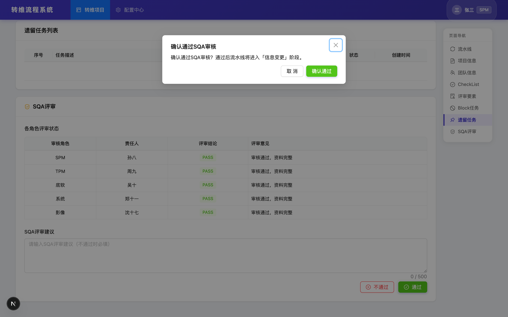

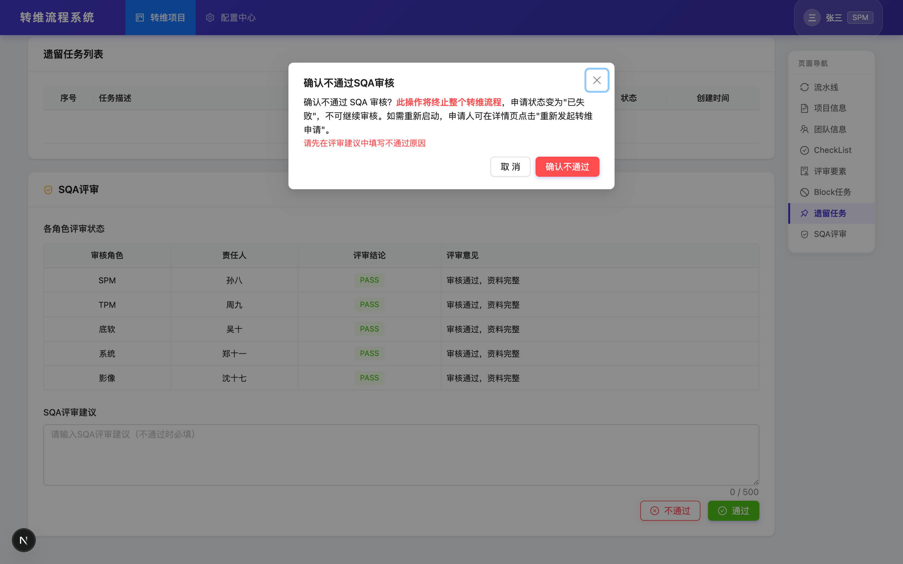

#### 5.7.3 布局分区

```
┌─ [← 返回] SQA审核 ⋄ {projectName}  [sqaReview Tag]
├───────────────────────────────────────────┬──────────
│ (条件: 驳回处理模式 Alert)                │ 浮动锚点
│ [pipeline]                                │ 1. pipeline
│ [项目信息]                                │ 2. 项目信息
│ [团队]                                    │ 3. 团队
│ [转维 CheckList readonly]                 │ 4. CheckList
│ [转维要素 readonly]                       │ 5. 评审要素
│ [Block 任务 readonly]                     │ 6. Block
│ [遗留任务 readonly]                       │ 7. 遗留
│ [SQA 审核区]                              │ 8. SQA 审核
│   - 角色结论速览表                         │
│   - SQA 评审建议 TextArea                  │
│   - [通过] [驳回] 按钮                      │
└───────────────────────────────────────────┴──────────
```

#### 5.7.4 交互清单

##### A. 进入条件与 guard

- `currentUser.role === 'SQA'`：前置条件，非 SQA 打开 URL 显示"当前用户无 SQA 审核权限"
- `isSqaInProgress = pipeline.sqaReview === 'in_progress'`
- `isRejectionMode = pipeline.maintenanceReview === 'in_progress' && anyRoleRejected`
- `canOperate = status === 'in_progress' && (isSqaInProgress || isRejectionMode)`
- 不满足 canOperate 时，SQA 审核区的按钮 disable 并显示当前节点状态说明

##### B. 驳回处理模式 Alert

**显示条件：** `isRejectionMode === true`

**样式：** `type=warning, showIcon`

**内容：**
- 标题 "当前处于驳回处理模式"
- 描述 "维护审核中有角色被拒绝，请核实情况后决定是否终止转维流程。SQA 不通过后流程将直接终止，申请人可在详情页发起重开。"

##### C. 左主区（前 7 section）

结构与详情页相同，**均为只读**。

##### D. SQA 审核区

###### D.1 角色结论速览表

**用途：** SQA 快速了解 5 角色的审核状态。

**列：** 角色 / 责任人（维护） / 结论 Tag（N/A | PASS | Fail）/ 意见

**结论推导：**
- `roleProgress.reviewStatus` 为 `not_started | in_progress` → N/A
- `completed` → PASS
- `rejected` → Fail

**意见取值：**
- 通过：固定文案 "审核通过，资料完整"
- 驳回：取该角色 rejected 条目中第一条 `reviewComment`

###### D.2 SQA 评审建议

- **控件：** TextArea，rows=5，maxLength=500，showCount
- **placeholder：** "请输入 SQA 评审建议（不通过时必填）"
- **disabled：** `!canOperate` 时禁用

###### D.3 操作按钮

- **通过**（绿）：`canOperate && !isRejectionMode` → 弹 `Modal.confirm` 二次确认 → `handleApprove()`
  - 驳回处理模式下此按钮 **disable**
- **驳回**（红）：`canOperate` → 弹 `Modal.confirm` → `handleReject()`
- **无法操作时**：按钮区显示灰色说明文字（如 "SQA 审核未开始 / 已完成 / 已失败"）

##### E. 通过确认

**`Modal.confirm`：**
- 标题 "SQA 审核通过"
- 内容 "确认本次 SQA 审核通过？通过后流水线进入信息变更阶段。"
- 按钮 取消 / 确认

**确认后：**
- `pipeline.sqaReview='success'`、`pipeline.infoChange='in_progress'`
- 若填了评审建议，作为 SQA 意见存档（本期 UI 未展示到详情页历史，但在 state 里）
- toast success "SQA 审核通过，流水线进入信息变更阶段"
- `router.push('/workbench/{id}')`

##### F. 驳回确认

**`Modal.confirm`：**
- 标题 "SQA 审核驳回"
- 内容 "确认驳回本次 SQA 审核？驳回后转维流程将直接终止，不可恢复。"
- 按钮 取消 / 确认（danger）

**确认前校验：** `sqaComment.trim()` 必填 → toast warning "请填写 SQA 评审建议"，不弹 confirm。

**确认后：**
- `status='failed'`、`failureReason = sqaComment`、`pipeline.sqaReview='failed'`
- 若 maintenanceReview 处于 in_progress（驳回处理模式下），同时标为 `failed`（终止）
- toast success "SQA 审核不通过，转维流程已终止"
- `router.push('/workbench/{id}')`

##### G. 浮动锚点

- 同详情页，8 项；滚动高亮。

#### 5.7.5 权限与可见性

- 只有 SQA 角色的用户能做操作；其他用户即使强制进入此 URL，也只能看内容不能操作。
- SQA 审核按钮在工作台条件见 §5.2 表 C。

#### 5.7.6 状态与边界

- **驳回是终态**：不可撤销；失败后的申请可由 SPM 走"重开"流程生成新申请。
- **驳回处理模式下只能驳回**：这是强约束，防止 SQA 在维护审核未完成时强行放行。
- 非法强刷（比如申请已 failed/cancelled）：SQA 审核区整体 disable，只提供只读内容回溯。
- 评审建议 500 字上限，超出会被 Ant Design TextArea 自动截断。

---

### 5.8 配置中心（`/config`）

#### 5.8.1 功能定位

模板管理系统入口。两类模板：
1. **CheckList（转维材料）模板**：60 条 mock 模板
2. **评审要素模板**：20 条 mock 模板

每类模板支持版本查看、版本对比、导入、导出。**本期版本切换、编辑、新增均为 mock 态**（UI 完整但不写回 mock 源）。

#### 5.8.2 截图

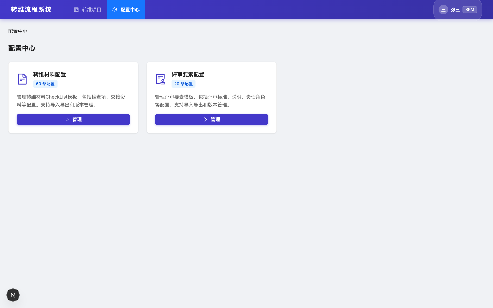

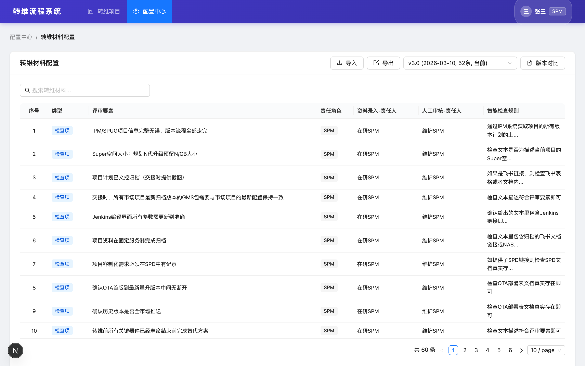

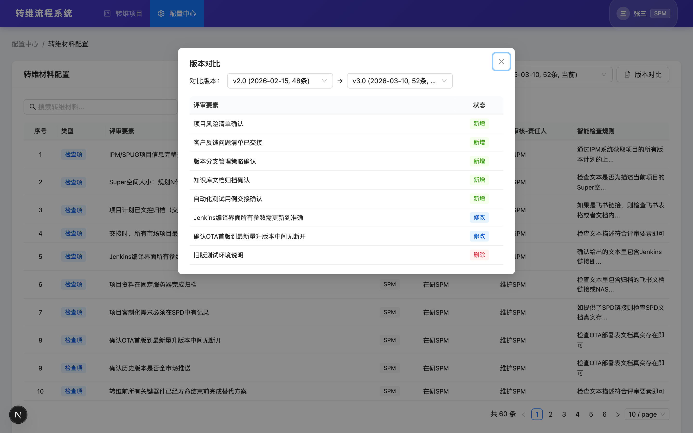

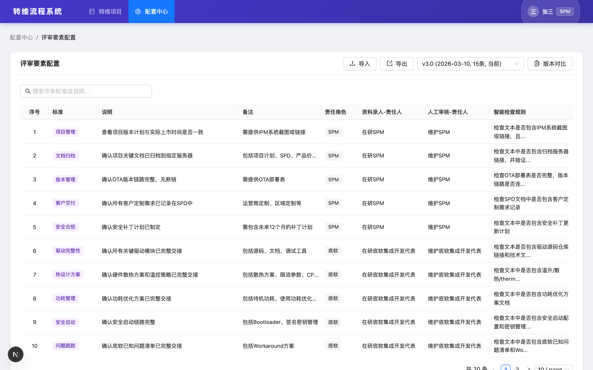

#### 5.8.3 索引页（`/config`）

- **面包屑：** "配置中心"
- **入口卡**：2 张
  - CheckList 模板（icon FileTextOutlined）：副标题显示当前版本模板数（"共 60 条"），点击 → `/config/checklist`
  - 评审要素模板（icon CheckSquareOutlined）：副标题 "共 20 条"，点击 → `/config/review-elements`

#### 5.8.4 CheckList 模板管理（`/config/checklist`）

##### A. 头部

- 面包屑 "配置中心 / CheckList 模板"
- 标题 "CheckList 模板"
- 右侧：版本选择 Dropdown（v1.0 / v2.0 / v3.0，默认 v3.0 当前版本）+ "版本对比"按钮 + "导入" + "导出"

##### B. 表格列

| 列 | 宽度 | 渲染 |
|---|---|---|
| seq | 60 | 序号 |
| type | 100 | Tag（"检查项" 蓝 / "交接资料" 紫） |
| checkItem | — | ellipsis + Tooltip |
| responsibleRole | 100 | Tag |
| entryRole | 110 | "在研{RoleType}" 纯文本 |
| reviewRole | 110 | "维护{RoleType}" 纯文本 |
| aiCheckRule | 200 | 截断 20 字 + Tooltip |

##### C. 版本对比弹窗

- **触发：** 点"版本对比"
- **内容：**
  - 两列对比 v2.0 → v3.0（或任选 2 版本）
  - 每行标签：新增（绿）/ 修改（蓝）/ 删除（红）
  - 共 8 条示例对比数据

##### D. 导入/导出

- 导入：点击"导入"→ 选择 xlsx 文件 → toast success "导入成功"（mock）
- 导出：点击"导出"→ 触发浏览器下载（mock）→ toast success "导出成功，文件已下载"

#### 5.8.5 评审要素模板管理（`/config/review-elements`）

结构与 CheckList 模板相同，差异：

- 标题 "评审要素模板"
- 表格列：standard（Tag 紫色）/ description / remark / responsibleRole / entryRole / reviewRole / aiCheckRule
- 共 20 条 mock 数据

#### 5.8.6 权限与可见性

- 所有登录用户均可查看；本期不做编辑权限区分（未来应由 admin 独享）。
- 导入/导出 mock 无权限校验。

#### 5.8.7 状态与边界

- 版本切换当前不影响已发起的申请（已发起的申请在创建时已 snapshot 当时的模板生成条目）。
- 版本对比是演示数据，不基于真实 diff 算法。
- 模板编辑功能本期未实现。

---

## 6. 数据模型

### 6.1 枚举清单

| 枚举 | 值 | 含义 |
|------|---|------|
| **PipelineNodeStatus** | not_started | 未开始 |
| | in_progress | 进行中 |
| | success | 完成 |
| | failed | 失败 |
| **RoleNodeStatus** | not_started | 角色未开始（录入或评审） |
| | in_progress | 进行中 |
| | completed | 完成 |
| | rejected | 被驳回 |
| **EntryStatus** | not_entered | 未录入 |
| | draft | 草稿 |
| | entered | 已录入 |
| **AICheckStatus** | not_started | 未开始 |
| | in_progress | 检查中 |
| | passed | 通过 |
| | failed | 不通过 |
| **ReviewStatus** | not_reviewed | 未评审 |
| | reviewing | 评审中 |
| | passed | 通过 |
| | rejected | 驳回 |
| **PipelineStatus** (= 申请 status) | in_progress | 进行中 |
| | completed | 完成 |
| | cancelled | 已关闭 |
| | failed | 已失败（SQA 驳回） |
| **RoleType** | SPM | 项目管理 |
| | TPM | 测试 |
| | SQA | 质量 |
| | 底软 | Base Software |
| | 系统 | System |
| | 影像 | Imaging |
| **PipelineRole** | SPM / 测试 / 底软 / 系统 / 影像 | 5 并行角色（无 SQA） |
| **TeamType** | research | 在研团队 |
| | maintenance | 维护团队 |

### 6.2 核心实体

#### 6.2.1 TransferApplication

| 字段 | 类型 | 存储/计算 | 说明 |
|------|------|-----------|------|
| id | string | 存储 | 形如 `app-xxx`，Date.now() 生成 |
| projectId | string | 存储 | — |
| projectName | string | 存储 | 冗余便于列表展示 |
| applicant / applicantId | string | 存储 | 申请发起人 |
| team | ProjectTeam | 存储 | { research: TeamMember[], maintenance: TeamMember[] } |
| plannedReviewDate | string | 存储 | YYYY-MM-DD |
| remark | string | 存储 | — |
| status | PipelineStatus | 存储 | 见枚举 |
| cancelReason | string? | 存储 | 仅 status=cancelled |
| failureReason | string? | 存储 | 仅 status=failed（= SQA 意见） |
| predecessorId | string? | 存储 | 指向上一次失败的申请（重开场景） |
| reopenedAsId | string? | 存储 | 被重开时指向新申请 |
| pipeline | PipelineState | **部分计算** | 5 节点 + roleProgress |
| createdAt / updatedAt | ISO string | 存储 | — |

#### 6.2.2 PipelineState

| 字段 | 类型 | 存储/计算 |
|------|------|-----------|
| projectInit / dataEntry / maintenanceReview / sqaReview / infoChange | PipelineNodeStatus | **部分计算**（由 Context 根据 roleProgress 自动推导 dataEntry/maintenanceReview） |
| roleProgress | RoleProgress[] | **计算**（由 Context 从 CheckListItem + ReviewElement 聚合） |

**推导规则：**
- `roleProgress[i].entryStatus`：
  - 所有条目未录入 → not_started
  - 存在驳回条目 → rejected
  - 全部 entered + passed → completed
  - 其他 → in_progress
- `roleProgress[i].reviewStatus`：
  - 全部 not_reviewed → not_started
  - 存在 rejected → rejected
  - 全部 passed → completed
  - 其他 → in_progress（即 reviewing 态）
- `pipeline.dataEntry`：所有角色 entryStatus===completed → success；任一 rejected → 保持 in_progress（不降级）
- `pipeline.maintenanceReview`：所有角色 reviewStatus===completed → success；成功时自动把 sqaReview 从 not_started 跳到 in_progress
- `pipeline.sqaReview`：
  - 当 maintenanceReview 成功时：自动 in_progress
  - 当任一角色 rejected 且 sqaReview 是 not_started：自动 in_progress（驳回处理模式）
  - 由 SQA 页面显式设置为 success/failed

#### 6.2.3 CheckListItem / ReviewElement

字段基本一致，差异：CheckListItem 有 `type + checkItem`，ReviewElement 有 `standard + description + remark`。

| 字段 | 类型 | 说明 |
|------|------|------|
| id | string | `{applicationId}-cli-001` / `{applicationId}-rei-001` |
| applicationId | string | 外键 |
| seq | number | 序号 |
| type / checkItem / standard / description / remark | string | 业务描述字段 |
| responsibleRole | PipelineRole | — |
| entryPerson / entryPersonId | string | 录入责任人（可被委派替换） |
| reviewPerson / reviewPersonId | string | 审核责任人（可被委派替换） |
| aiCheckRule | string | AI 检查规则描述 |
| entryContent | string? | 用户录入内容 |
| deliverables | string[] | 交付件列表（本期未用，EntryContentRenderer 从 entryContent 解析） |
| entryStatus | EntryStatus | — |
| aiCheckStatus | AICheckStatus | — |
| aiCheckResult | string? | AI 诊断文案 |
| reviewStatus | ReviewStatus | — |
| reviewComment | string? | 评审意见 |
| delegatedTo | string[] | 被委派人 ID 队列（历史追溯，不是当前责任人） |

#### 6.2.4 BlockTask / LegacyTask

| 字段 | 类型 | 说明 |
|------|------|------|
| id | string | — |
| applicationId | string | — |
| description | string | BlockTask 另有 resolution 字段（计划解法） |
| responsiblePerson / department / deadline | string | 责任 & 截止 |
| status | 'open' / 'resolved' / 'cancelled' | — |
| createdAt | ISO string | — |

**差异：** Block 有 `resolution`，Legacy 没有；Block 在维护审核**驳回**时创建，Legacy 在**通过**时可选附加。

#### 6.2.5 TodoItem

| 字段 | 类型 | 说明 |
|------|------|------|
| id | string | — |
| applicationId | string | — |
| projectName | string | 冗余 |
| node | string | "资料录入" / "SPM 维护审核" / "SQA 审核" 等 |
| responsiblePerson | string | 应在工作台待办面板看到的人 |
| type | 'entry' / 'review' / 'sqa_review' | 用于跳转路由 |

#### 6.2.6 HistoryRecord

| 字段 | 类型 | 说明 |
|------|------|------|
| id | string | — |
| applicationId | string | — |
| action | string | 操作名称（"创建转维申请" / "审核通过" 等） |
| operator | string | 操作人姓名 |
| detail | string | 详情或 JSON |
| timestamp | ISO string | — |

#### 6.2.7 CheckListTemplate / ReviewElementTemplate

模板数据源。与 Item 的区别：不含 applicationId / entryPerson / 状态字段，仅结构+规则。

### 6.3 E-R 图

> **【画板 7】数据实体关系图** · 飞书链接：*（见飞书文档内嵌画板）*
>
> 图示要点：
> - TransferApplication 1-N CheckListItem / ReviewElement（按 applicationId）
> - TransferApplication 1-N BlockTask / LegacyTask
> - TransferApplication 1-N HistoryRecord
> - TransferApplication 1-N TodoItem
> - TransferApplication 0-1 TransferApplication（predecessor / reopenedAs，循环关系）
> - CheckListTemplate 0-N CheckListItem（在创建/重开时作为 snapshot 来源）
> - ReviewElementTemplate 0-N ReviewElement（同上）
> - User N-M 项目团队（通过 ProjectTeam.research / maintenance）

### 6.4 关键推导关系

- `application.pipeline.roleProgress` 由 `checklistItems + reviewElements` 聚合
- `application.pipeline.dataEntry/maintenanceReview/sqaReview` 由 roleProgress 聚合
- `application.status` 只由用户行为显式修改（创建 / 关闭 / SQA 通过 / SQA 驳回），不自动推导
- `todos` 由 `applications + roleProgress` 派生（本期为 mock，见 `src/mock/*todos*`）

---

## 7. 权限与可见性

### 7.1 6 种按钮的显示条件矩阵

| 按钮 | 必要条件 1 | 必要条件 2 | 必要条件 3 |
|------|-----------|-----------|-----------|
| 详情 | — | — | — |
| 录入 | `status==='in_progress'` | `dataEntry==='in_progress'` 或 当前用户角色 rejected | 当前用户在在研团队对应 role **或** `delegatedTo` 含当前用户 |
| 评审 | `status==='in_progress'` | `maintenanceReview==='in_progress'` | 当前用户在维护团队对应 role |
| SQA审核 | `currentUser.role==='SQA'` | `sqaReview==='in_progress'` 或 "驳回处理模式" | — |
| 关闭 | `status==='in_progress'` | `sqaReview!=='in_progress'` 且无任一角色正在评审 | 当前用户 === 申请人 |
| 重开 | `status==='failed'` | `!reopenedAsId` | 当前用户是项目在研 SPM 或管理员 |

### 7.2 权限可视化

> **【画板 8】权限可视化** · 飞书链接：*（见飞书文档内嵌画板）*
>
> 图示要点：以 swim-lane 展示 4 个核心角色（在研 SPM / 在研非 SPM / 维护成员 / SQA）在各 pipeline 节点能做的操作。

### 7.3 角色 × 操作 × 状态三维矩阵（精简版）

| 角色 | 申请人 = 自己 | dataEntry 阶段 | maintenanceReview 阶段 | sqaReview 阶段 | failed | cancelled |
|------|--------------|----------------|------------------------|----------------|--------|-----------|
| 在研 SPM（申请人） | 可关闭 | 可录入 SPM 条目、可被其他角色驳回后再录入 | — | — | 可重开 | — |
| 在研其他角色 | — | 可录入自角色条目 | — | — | — | — |
| 维护角色成员 | — | — | 可评审自角色条目 / 通过 / 驳回 / 委派 | — | — | — |
| SQA | — | — | 仅在驳回处理模式进入 | 可通过 / 驳回 | — | — |
| 管理员 | 同申请人 | — | — | — | 可重开任意失败申请 | — |
| 被委派人 | — | 可录入受委派条目 | 可评审受委派条目 | — | — | — |

---

## 8. 交互规范

### 8.1 全量 Toast 文案表

| 分类 | 场景 | 文案（Chinese） | 类型 |
|------|------|----------------|------|
| 工作台 | 关闭弹窗原因空 | 请填写关闭原因 | warning |
| 工作台 | 关闭成功 | 流水线已关闭 | success |
| 申请 | 新建成功 | 转维申请提交成功！ | success |
| 申请 | 新建失败 | 提交失败，请重试 | error |
| 申请 | 重开成功 | 转维申请已重新发起，之前录入的内容已保留 | success |
| 录入 | 暂存 | 已暂存 | success |
| 录入 | 确认提交 | 已确认提交，AI检查进行中... | success |
| 录入 | 录入内容空 | 请输入内容 | warning |
| 录入 | AI 通过 | AI检查通过 | success |
| 录入 | AI 不通过 | AI检查不通过，请修改后重新提交 | error |
| 录入 | 委派 | 已委派给 {name}，录入责任人已更新 | success |
| 录入 | 委派未选人 | 请选择委派人员 | warning |
| 录入 | 提交审核有未完成 | 仍有未完成录入或AI检查未通过的条目，请先完成所有录入 | warning |
| 录入 | 提交审核成功 | 「{role}」角色已提交维护审核 | success |
| 维护审核 | 单条通过 | 已通过 | success |
| 维护审核 | 单条驳回 | 已标记为不通过 | success |
| 维护审核 | 批量操作 | 批量{通过/不通过} {n} 条记录 | success |
| 维护审核 | 角色通过 | 审核通过，已提交 | success |
| 维护审核 | 角色驳回 | 已拒绝并创建Block任务，已回退到资料录入阶段 | success |
| 维护审核 | 遗留任务不全 | 请填写完整所有遗留任务信息 | warning |
| 维护审核 | Block 任务不全 | 请填写完整所有Block任务信息 | warning |
| 维护审核 | 评审意见空 | 请填写评审意见 | warning |
| 维护审核 | 委派 | 已将{role}角色的审核任务委派给 {name} | success |
| SQA 审核 | 通过 | SQA审核通过，流水线进入信息变更阶段 | success |
| SQA 审核 | 驳回 | SQA审核不通过，转维流程已终止 | success |
| SQA 审核 | 意见空 | 请填写SQA评审建议 | warning |
| 配置中心 | 导入成功 | 导入成功 | success |
| 配置中心 | 导出成功 | 导出成功，文件已下载 | success |

### 8.2 确认弹窗模式

- **`Modal.confirm`（单确认）**：适用于"执行即可"的操作（提交录入审核、SQA 通过/驳回）
- **双按钮 Modal 自建**（取消 + 操作）：适用于需要用户填充额外信息的操作（关闭申请、通过带遗留任务、驳回带 Block）

### 8.3 空状态清单

| 场景 | 文案 | 插画 |
|------|------|------|
| 工作台无数据 | 暂无数据 | Ant Design 默认 |
| 待办面板 | 暂无待办任务 / 所有任务都处理完了，继续保持！ | ClockCircleOutlined |
| 详情页 CheckList/要素 | 暂无条目 | Ant Design 默认 |
| 详情页 Block / 遗留 | 暂无任务 | Ant Design 默认 |
| 详情页历史 | 暂无操作记录 | Ant Design 默认 |
| 录入页无权限 | 当前用户无录入权限 | — |
| 维护审核无权限 | 当前用户无评审权限 | — |
| SQA 审核无权限 | 当前用户无SQA审核权限 | — |
| 申请 ID 无效 | 未找到转维申请 | — |

### 8.4 表单校验规则

| 字段 | 规则 |
|------|------|
| 项目选择 | 必填 |
| 项目人员（每角色） | 必填 / 同一人不得跨角色重复 |
| 计划评审日期 | 必填 / 不得早于今天 |
| 备注 | 选填 / ≤500 字 |
| 录入内容 | 必填（trim 非空） |
| 关闭原因 | 必填 / ≤500 字 |
| 评审意见 | 必填 / 无长度上限 |
| SQA 评审建议 | 驳回必填 / ≤500 字 |
| 遗留/Block 任务行 | description、responsiblePerson、deadline 都必填 |

### 8.5 URL query param 约定

| Key | 值 | 生效页面 | 用途 |
|-----|---|---------|------|
| from | appId | `/workbench/apply` | 重开源申请 ID |

（本期仅此一个 param）

---

## 9. 视觉规范

### 9.1 主题色

| 用途 | 色值 | 来源 |
|------|------|------|
| 主品牌色（Primary） | #4338ca (indigo-600) | Tailwind + Ant Design 覆写 |
| Primary Light | #eef2ff (indigo-50) | — |
| 背景 | #f0f2f5 | Ant Design 默认 |
| 正文 | #171717 | — |
| 辅色边框 | #f0f0f0 | — |

### 9.2 状态色

| 状态 | 色值 | 典型应用 |
|------|------|----------|
| 成功 | #52c41a | completed / passed Tag |
| 警告 | #faad14 | SQA 正常进行中按钮、暂存按钮边框 |
| 失败/危险 | #ff4d4f | failed / rejected Tag、重开按钮(橙) #fa541c |
| 进行中 | #1677ff | in_progress / reviewing Tag |
| 默认 | #d9d9d9 | not_started / not_entered Tag |

### 9.3 角色色

| 角色 | 色值 |
|------|------|
| SPM | #4338ca |
| TPM / 测试 | #0891b2 |
| SQA | #059669 |
| 底软 | #d97706 |
| 系统 | #dc2626 |
| 影像 | #7c3aed |

### 9.4 Ant Design 覆写清单（src/app/globals.css）

| 组件 | 覆写 |
|------|------|
| Card | border-radius 10px；shadow 0 1px 3px + hover 0 4px 12px |
| Table Header | bg #fafbfc；font-weight 600；font-size 13px；border-bottom 2px #f0f0f0 |
| Table Row Hover | bg #f8f9ff（浅 indigo） |
| Table 取消行 | opacity 0.5，hover 0.7 |
| Button | border-radius 6px；primary shadow 0 2px 6px rgba(67,56,202,0.3)；hover translateY(-1px) |
| Tag | border-radius 4px；font-size 12px |
| Modal | border-radius 12px |
| Scrollbar | 6px；#d9d9d9 thumb；hover #bbb |

### 9.5 字体

- 系统默认 sans-serif 栈：`-apple-system, Segoe UI, Roboto, "Helvetica Neue", sans-serif`

---

## 10. 外部依赖与未对接项

### 10.1 飞书 / IM 通知

- 当前仅通过"工作台待办面板"展示；未来接入飞书 webhook/机器人，待办生成时推送卡片到责任人。
- 推送时机：
  - 角色被分配（创建申请时）
  - 条目 AI 检查失败时提醒录入人
  - 维护审核通过 / 驳回时提醒在研角色
  - SQA 审核入场时提醒 SQA
  - SQA 通过 / 驳回时提醒申请人

### 10.2 AI 检查服务

**当前契约（mock）：**
- 输入：`entryContent`（文本，可能含链接）+ `aiCheckRule`
- 输出：`{ aiCheckStatus: 'passed'|'failed', aiCheckResult: string }`
- 耗时：1–2 s

**接入真实服务时约定：**
- 调用方在录入确认时立即置 `aiCheckStatus='in_progress'`，轮询或 WebSocket 拿结果
- 结果写回 Context；触发 `roleProgress` 重算
- 失败重试策略由产品定义（默认不自动重试，用户点"重新检查"按钮）

### 10.3 用户中心 / 权限系统

- 本期 15 mock 用户写死；`isAdmin` 字段纯 mock
- 生产接入时需：OAuth / SSO 登录 + 拉取企业通讯录（姓名、部门、邮箱、飞书 user_id）+ RBAC 映射到本系统 RoleType

### 10.4 后端 API 占位

| API | 功能 |
|-----|------|
| GET /applications | 列表（支持 status 过滤、关键字、分页） |
| POST /applications | 新建 |
| POST /applications/:id/reopen | 重开（后端逻辑等价于本期 reopenApplication） |
| PATCH /applications/:id | 关闭、状态变更 |
| GET /applications/:id | 详情（含 pipeline + items + tasks + history） |
| PATCH /applications/:id/items/:itemId | 更新条目（录入/委派/审核） |
| POST /applications/:id/role/:role/submit | 提交角色审核 |
| POST /applications/:id/sqa/approve / reject | SQA 操作 |
| GET /templates/checklist / GET /templates/review-elements | 模板列表 & 版本 |
| POST /templates/:id/import | 导入 |
| GET /todos | 当前用户待办 |
| GET /history/:appId | 历史记录 |

所有接口均应携带 tracing 字段（operator、操作时间）。

---

## 11. 附录

### 11.1 路由表

| 路由 | 参数 | 页面 |
|------|------|------|
| `/workbench` | — | 工作台首页 |
| `/workbench/apply` | `?from={appId}` | 新建 / 重开申请 |
| `/workbench/{id}` | id | 详情页 |
| `/workbench/{id}/entry` | id | 资料录入 |
| `/workbench/{id}/review` | id | 维护审核 |
| `/workbench/{id}/sqa-review` | id | SQA 审核 |
| `/config` | — | 配置中心索引 |
| `/config/checklist` | — | CheckList 模板管理 |
| `/config/review-elements` | — | 评审要素模板管理 |

### 11.2 Mock 数据结构说明

- `src/mock/users.ts`：15 用户
- `src/mock/projects.ts`：项目主数据
- `src/mock/applications.ts`：申请 mock + `generateChecklist/generateReviewEls` 工具函数 + item overrides（给特定申请注入状态用于演示）
- `src/mock/checklist-template.ts`：60 条 CheckList 模板
- `src/mock/review-element-template.ts`：20 条评审要素模板
- `src/mock/todos.ts`：mock 待办
- `src/mock/block-tasks.ts` / `legacy-tasks.ts` / `history.ts`：任务与历史

### 11.3 组件复用清单

| 组件 | 位置 | 用途 |
|------|------|------|
| `AppLayout` | src/components/layout | 顶栏 + 用户切换 |
| `PipelineProgress` | src/components/pipeline | 5 节点 + 可选角色圆点 |
| `MemberSelect` | 内联于 apply/page.tsx | 角色人员下拉 |
| `useColumnSearch` | src/components/shared | 表格列关键字搜索 |
| `EntryContentRenderer` | src/components/shared | 飞书/Samba/URL 识别渲染 |

### 11.4 已知限制 & 未实现

- **信息变更节点（infoChange）**：管道中有占位，但无独立页面
- **模板编辑/新增**：配置中心仅展示 + 导入/导出 mock
- **遗留任务独立看板**：详情页有展示，但没有运营入口
- **飞书真实推送**：未接入
- **后端持久化**：完全 mock，刷新数据会丢失（除首次生成外）
- **国际化**：当前仅中文
- **深色模式**：未支持
- **移动端**：未适配（仅适配 1280+ 桌面）

---

## 附：文档状态

- 本版本基于前端代码 main 分支 commit b7fa37a 实测盘点生成。
- 截图使用 puppeteer 脚本（`scripts/take-screenshots.js`）批量生产。
- 画板链接将在飞书文档版本中内嵌（见飞书文档顶部"画板目录"）。
- 如发现与实际前端不符处，以代码为准，并提 issue 回来修订 PRD。

---

## 附：飞书画板 Token 映射

本文档在飞书版本中内嵌了 8 张可编辑画板。如需直接编辑画板，可用 `lark-cli whiteboard +update` + 下表 token：

| 编号 | 主题 | 画板 token |
|------|------|-----------|
| WB1 | 团队-角色-管道关系 | IlXtwRWaehyrKgb1lvNcC0pynJ3 |
| WB2 | 端到端业务流程 | G2zfwc56BheahIbWD6GcGAsXnsc |
| WB3 | 申请 status 状态机 | DpmlwbEgRhAxMabofgecta5fnFf |
| WB4 | Pipeline 节点状态机 | FArtwGoT8hUO29bqICdcockfnM4 |
| WB5 | 条目三维状态机 | M8J5wegCWhlHwsb6eg3cDgIbnOg |
| WB6 | 重开流程时序 | VKjGwV6q1h1JmNb0XfscY1nCnCh |
| WB7 | 数据实体关系 (E-R) | Yaj7wOPjYhyQdIbjFUoc9BSdnnc |
| WB8 | 权限可视化 (swim-lane) | MPkLwg0qOhQ5qYbfo7Jc1zy2ndh |

画板 token 可在 Mermaid / PlantUML 基础上迭代；文档 ID：`AiG6dzi5WoI6HyxyrjrcOwlSnCf`。
