# 转维电子流系统 - 详细需求文档

> **版本**: v1.0
> **日期**: 2026-03-17
> **作者**: 产品经理
> **状态**: 需求评审中
> **原型地址**: https://transfer-maintenance-flow-repo.vercel.app

---

## 一、产品概述

### 1.1 背景

项目从"在研"阶段转入"维护"阶段时，需要在研团队将项目资料完整交接给维护团队。当前交接流程依赖线下沟通和邮件，缺乏标准化流程和可追溯性。本系统旨在将转维交接过程电子化、标准化、可追溯化。

### 1.2 目标用户

| 角色 | 说明 | 系统权限 |
|------|------|---------|
| SPM（项目经理） | 在研/维护项目负责人 | 发起申请、录入资料、审核资料 |
| TPM（测试经理） | 在研/维护测试负责人 | 录入测试相关资料、审核测试资料 |
| 底软开发代表 | 在研/维护底软负责人 | 录入底软相关资料、审核底软资料 |
| 系统集成开发代表 | 在研/维护系统负责人 | 录入系统相关资料、审核系统资料 |
| SQA（质量保证） | 仅在研团队 | 关闭流水线 |

### 1.3 核心流程

```
项目发起 → 资料录入与AI检查 → 维护审核 → 信息变更（归档）
```

- **项目发起**: 创建转维申请后自动完成
- **资料录入与AI检查**: 在研团队4个角色（SPM/测试/底软/系统）并行录入资料，AI自动检查
- **维护审核**: 维护团队4个角色并行审核对应资料
- **信息变更**: 审核全部通过后进入归档阶段

---

## 二、角色与权限矩阵

### 2.1 团队角色映射

在研团队和维护团队按角色一一对应：

| 在研团队角色 | → | 维护团队角色 | 流水线角色标识 |
|:---:|:---:|:---:|:---:|
| 在研SPM | → | 维护SPM | SPM |
| 在研TPM | → | 维护TPM | 测试 |
| 在研底软 | → | 维护底软 | 底软 |
| 在研系统 | → | 维护系统 | 系统 |
| SQA | — | 无对应 | — |

### 2.2 权限矩阵

| 功能 | 在研SPM | 在研TPM | 在研底软 | 在研系统 | SQA | 维护SPM | 维护TPM | 维护底软 | 维护系统 |
|------|:---:|:---:|:---:|:---:|:---:|:---:|:---:|:---:|:---:|
| 发起转维申请 | ✅ | — | — | — | — | — | — | — | — |
| 录入本角色资料 | ✅ | ✅ | ✅ | ✅ | — | — | — | — | — |
| 委派录入任务 | ✅ | ✅ | ✅ | ✅ | — | — | — | — | — |
| 提交审核 | ✅ | ✅ | ✅ | ✅ | — | — | — | — | — |
| 审核对应角色资料 | — | — | — | — | — | ✅ | ✅ | ✅ | ✅ |
| 委派审核任务 | — | — | — | — | — | ✅ | ✅ | ✅ | ✅ |
| 关闭流水线（审核前） | ✅ | — | — | — | — | — | — | — | — |
| 关闭流水线（审核中） | — | — | — | — | ✅ | — | — | — | — |
| 查看详情 | ✅ | ✅ | ✅ | ✅ | ✅ | ✅ | ✅ | ✅ | ✅ |

---

## 三、功能模块详细说明

### 3.1 工作台（首页）

**路由**: `/workbench`

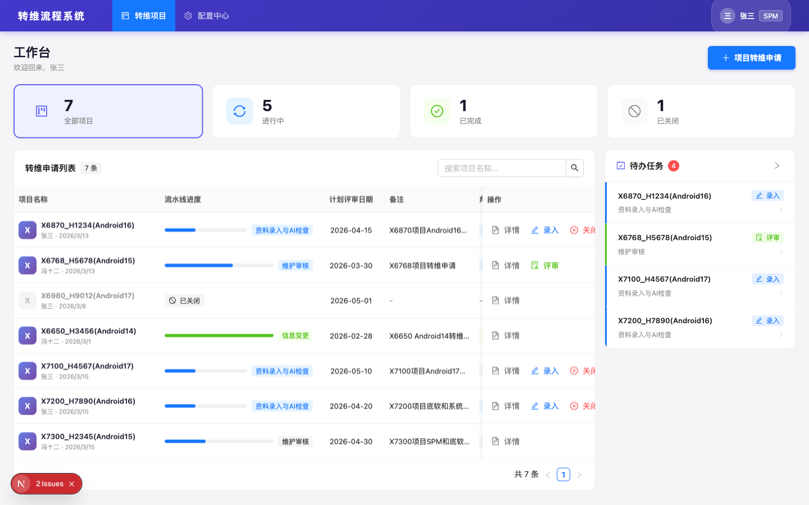

#### 3.1.1 页面结构

页面从上到下包含以下区域：

1. **统计卡片区**: 显示全部项目、进行中、已完成、已关闭四个统计数字，点击可快速筛选
2. **转维申请列表**: 主表格，展示所有转维申请记录
3. **待办任务面板**: 右侧可折叠面板，展示当前用户的待办任务

#### 3.1.2 转维申请列表字段

| 字段 | 说明 |
|------|------|
| 项目名称 | 显示项目名称、申请人、最近更新时间 |
| 流水线进度 | 根据当前登录用户的角色，高亮显示用户所在的节点 |
| 计划评审日期 | 预计的转维评审日期 |
| 备注 | 申请备注信息，超长截断并hover提示 |
| 角色进度 | 以Tag形式展示4个角色的状态（进行中/已完成/已拒绝） |
| 操作 | 详情、录入、评审、关闭（按权限动态显示） |

#### 3.1.3 操作按钮显示规则

| 按钮 | 显示条件 |
|------|---------|
| 详情 | 始终显示 |
| 录入 | 项目进行中 且 处于资料录入阶段 且 当前用户是在研团队对应角色（或被委派） |
| 评审 | 项目进行中 且 处于维护审核阶段 且 当前用户是维护团队对应角色 |
| 关闭 | 项目进行中 且（审核前：申请人可关闭；审核中：SQA可关闭） |

#### 3.1.4 交互说明

- 点击统计卡片 → 切换列表筛选状态
- 搜索框支持按项目名称模糊搜索
- 点击"项目转维申请"按钮 → 跳转到申请页面
- 待办任务面板可通过箭头按钮折叠/展开
- 操作栏固定在表格最右侧，水平滚动时不随内容移动

#### 3.1.5 流水线进度显示规则

流水线进度根据当前登录用户在该申请中的角色来决定高亮节点：
- 用户在**在研团队**中 → 高亮"资料录入与AI检查"节点
- 用户在**维护团队**中 → 高亮"维护审核"节点
- 用户同时在两个团队中 → 显示当前流水线正在进行的节点

---

### 3.2 项目转维申请

**路由**: `/workbench/apply`

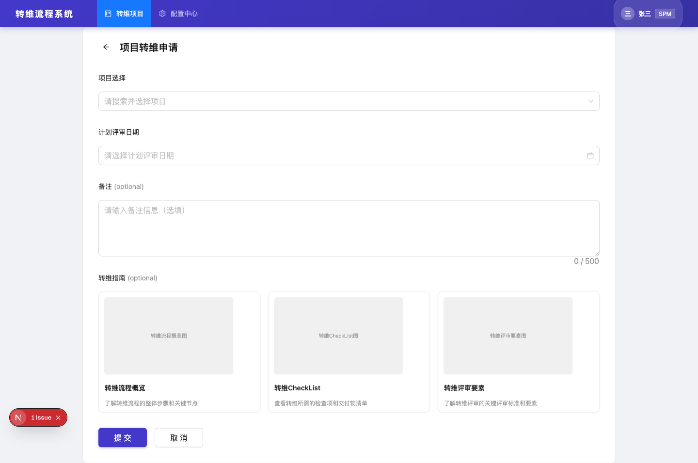

#### 3.2.1 表单字段

| 字段 | 类型 | 必填 | 说明 |
|------|------|:---:|------|
| 项目选择 | 下拉搜索 | ✅ | 仅显示当前用户有权限且未提交过转维申请（非已取消）的项目 |
| 计划评审日期 | 日期选择器 | ✅ | 选择预计的转维评审日期 |
| 备注 | 多行文本 | — | 最多500字 |
| 转维指南 | 只读卡片 | — | 展示转维流程概览、转维CheckList、转维评审要素三个引导卡片 |

#### 3.2.2 团队成员展示

选择项目后，系统自动加载项目的团队成员信息：

- **在研团队**与**维护团队**左右对照展示
- SPM、TPM、底软、系统四个角色一一对应（左在研 ↔ 右维护）
- SQA仅显示在在研团队最后一行，以虚线分隔
- 每个成员可通过下拉框修改（支持搜索）
- 维护团队中无SQA对应

#### 3.2.3 提交逻辑

点击"提交"后：
1. 校验必填项
2. 创建转维申请记录，状态为 `in_progress`
3. 项目发起节点自动设为 `success`
4. 资料录入与AI检查节点设为 `in_progress`
5. 从**配置中心**拉取转维材料模板（52条）和评审要素模板（15条），按角色分配责任人
6. 跳转到工作台页面，新记录出现在列表顶部

#### 3.2.4 防重复规则

已存在进行中（非已取消）转维申请的项目不会出现在项目选择下拉列表中。

---

### 3.3 转维申请详情

**路由**: `/workbench/[id]`

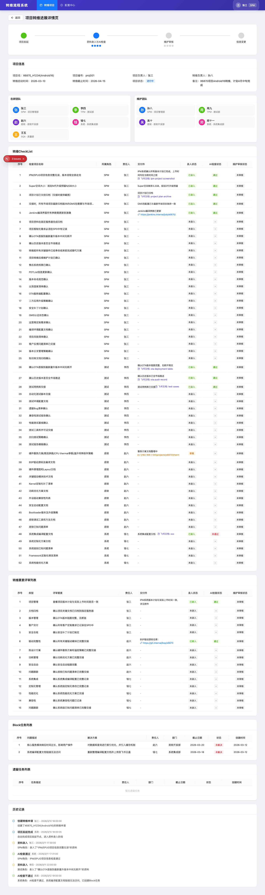

#### 3.3.1 页面结构

从上到下包含以下区域：

1. **流水线进度**: 四节点进度展示（项目发起 → 资料录入与AI检查 → 维护审核 → 信息变更），每个节点下展示4个角色的子状态
2. **项目信息**: 项目名、编号、负责人、转维负责人、启动/截止时间、状态、备注
3. **团队信息**: 在研团队和维护团队左右布局，每个成员以卡片形式展示（角色、姓名、部门）
4. **转维CheckList**: 52条检查项/交接资料的表格，显示录入状态、AI检查状态、维护审核状态
5. **转维要素评审列表**: 15条评审要素的表格
6. **Block任务列表**: 审核不通过时创建的Block任务
7. **遗留任务列表**: 审核通过时可选创建的遗留任务
8. **历史记录**: 时间轴形式展示操作记录

#### 3.3.2 交付件展示

交付件列智能识别录入内容中的链接：
- **飞书文档链接**: 自动提取文档类型标题（如"飞书文档: project-plan"），点击跳转
- **Samba服务器路径**: 以文件夹图标展示（如 `\\192.168.1.100\projects\...`），点击打开
- **其他URL**: 直接展示链接地址，点击跳转
- **纯文本**: 原样展示

---

### 3.4 资料录入与AI检查

**路由**: `/workbench/[id]/entry`

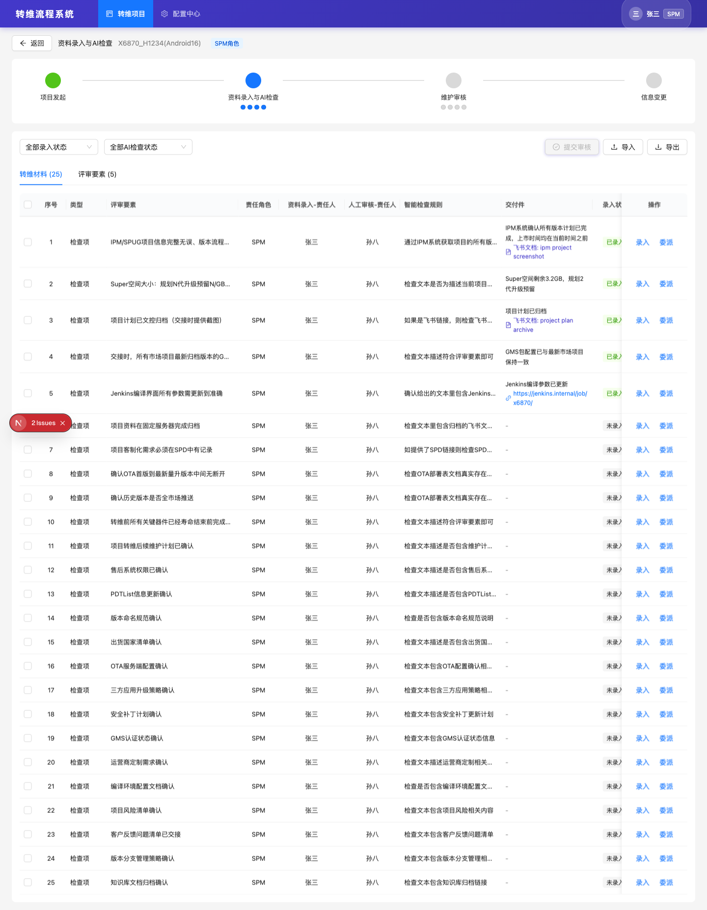

#### 3.4.1 页面结构

1. **顶部**: 返回按钮、页面标题、项目名称、当前角色标签
2. **流水线进度**: 与详情页相同
3. **筛选栏**: 录入状态筛选、AI检查状态筛选
4. **操作区**: 提交审核按钮、批量委派按钮、导入/导出按钮
5. **Tab切换**: 转维材料(52条) / 评审要素(15条)
6. **数据表格**: 按当前用户角色过滤显示

#### 3.4.2 数据过滤规则

表格仅显示与当前用户相关的数据：
- 当前用户角色对应的 `responsibleRole` 的记录
- `entryPersonId` 为当前用户的记录
- `delegatedTo` 包含当前用户的记录

#### 3.4.3 转维材料表格字段

| 字段 | 说明 |
|------|------|
| 序号 | 自增序号 |
| 类型 | 检查项 / 交接资料 |
| 评审要素 | 检查项名称 |
| 责任角色 | SPM / 测试 / 底软 / 系统 |
| 资料录入-责任人 | 在研团队对应角色成员 |
| 人工审核-责任人 | 维护团队对应角色成员 |
| 智能检查规则 | AI检查的规则描述 |
| 交付件 | 录入内容的智能链接展示 |
| 录入状态 | 未录入 / 暂存 / 已录入 |
| AI检查状态 | 未开始 / 检查中 / 通过 / 不通过（可点击查看详情） |
| 维护审核状态 | 未审核 / 审核中 / 通过 / 不通过 |
| 操作 | 录入、委派（固定在右侧） |

#### 3.4.4 录入操作

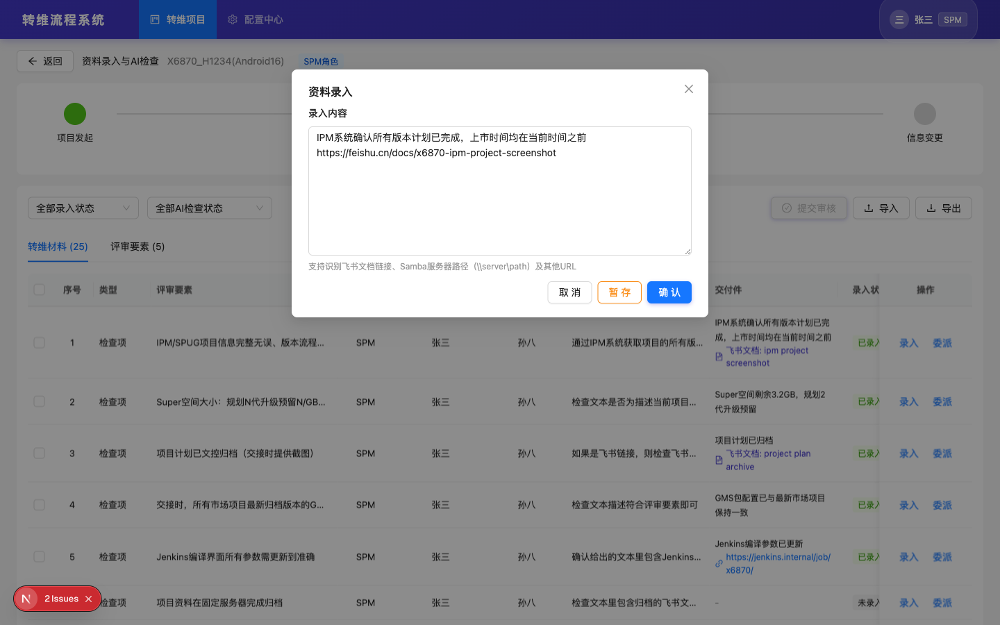

点击"录入"按钮弹出录入弹窗：

| 元素 | 说明 |
|------|------|
| 录入内容 | 多行文本输入框，8行高度 |
| 提示文字 | "支持识别飞书文档链接、Samba服务器路径及其他URL" |
| 暂存按钮 | 保存为草稿（`draft`），不触发AI检查 |
| 确认按钮 | 提交并触发AI检查（`entered` + `in_progress`） |
| 取消按钮 | 关闭弹窗，不保存 |

**交互说明**:
- 如该条目已有录入内容，打开弹窗时自动填充
- 暂存和确认操作实时保存到全局状态
- 确认提交后自动触发AI检查（状态变为"检查中"）
- 录入状态变化会实时更新流水线进度（对应角色的entryStatus从"未开始"变为"进行中"）

#### 3.4.5 委派操作

点击"委派"按钮弹出委派弹窗：
- 选择委派人员（下拉搜索，排除当前用户）
- 确认后，该条目的录入责任人变更为被委派人
- 被委派人可在工作台看到该任务

#### 3.4.6 提交审核

当前角色的所有转维材料和评审要素均满足以下条件时，"提交审核"按钮可用：
- `entryStatus === 'entered'`（已录入）
- `aiCheckStatus === 'passed'`（AI检查通过）

点击后弹出确认框，确认后：
1. 该角色的 `entryStatus` 变为 `completed`
2. 如果所有4个角色均完成 → 流水线 `dataEntry` 节点变为 `success`，`maintenanceReview` 进入 `in_progress`
3. 跳转到详情页

#### 3.4.7 状态自动流转规则

| 触发条件 | 角色 entryStatus 变化 |
|---------|---------------------|
| 任一条目暂存或确认提交 | `not_started` → `in_progress` |
| 所有条目已录入且AI检查通过 | `in_progress` → `completed` |

---

### 3.5 维护审核

**路由**: `/workbench/[id]/review`

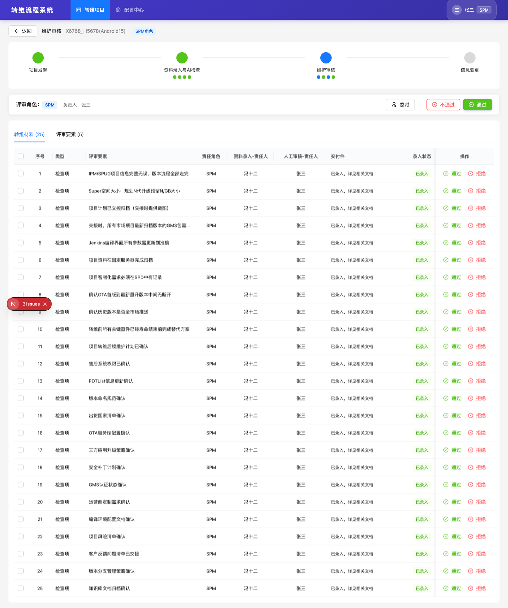

#### 3.5.1 页面结构

1. **顶部**: 返回按钮、页面标题、项目名称、当前角色标签
2. **流水线进度**: 与详情页相同
3. **审核操作栏**: 吸顶固定，显示评审角色、负责人，以及委派/不通过/通过按钮
4. **Tab切换**: 转维材料 / 评审要素
5. **数据表格**: 按当前用户维护角色过滤，支持勾选批量操作

#### 3.5.2 逐条审核

每条记录的操作列有两个按钮：
- **通过**: 将该条目 `reviewStatus` 设为 `passed`
- **拒绝**: 将该条目 `reviewStatus` 设为 `rejected`

操作实时保存，状态变化实时反映在表格和流水线进度中。

#### 3.5.3 批量审核

勾选多条记录后，操作栏出现"批量通过"和"批量不通过"按钮，一键修改选中记录的审核状态。

#### 3.5.4 审核通过（整体提交）

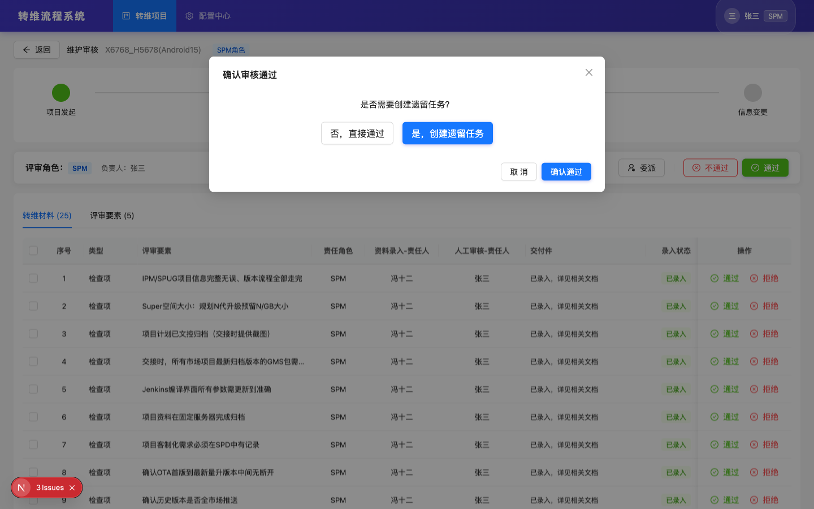

点击操作栏"通过"按钮弹出确认弹窗：

**第一步**: 询问是否需要创建遗留任务
- "否，直接通过" → 直接提交
- "是，创建遗留任务" → 进入遗留任务填写

**遗留任务表单**（可添加多条）:

| 字段 | 类型 | 必填 |
|------|------|:---:|
| 责任人 | 人员选择 | ✅ |
| 部门 | 文本输入 | ✅ |
| 问题描述 | 多行文本 | ✅ |
| 完成时间 | 日期选择 | ✅ |

**确认后**:
1. 将当前角色所有条目的 `reviewStatus` 批量设为 `passed`
2. 角色的 `reviewStatus` 变为 `completed`
3. 如果所有4个角色审核均完成 → `maintenanceReview` 变为 `success`
4. 跳转到详情页

#### 3.5.5 审核不通过

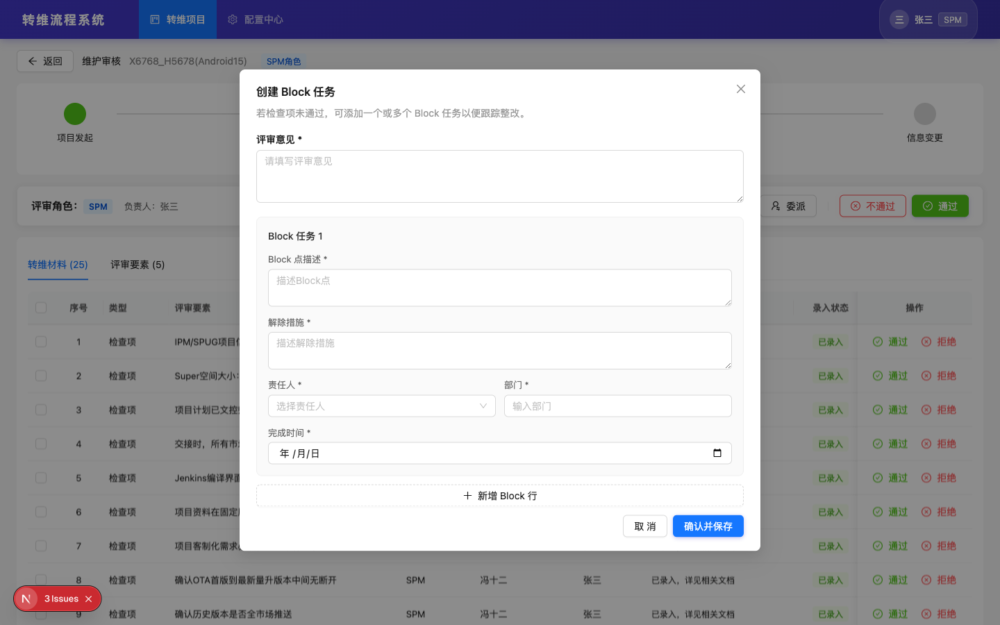

点击操作栏"不通过"按钮弹出Block任务创建弹窗：

| 字段 | 类型 | 必填 |
|------|------|:---:|
| 评审意见 | 多行文本 | ✅ |
| Block点描述 | 多行文本 | ✅ |
| 解除措施 | 多行文本 | ✅ |
| 责任人 | 人员选择 | ✅ |
| 部门 | 文本输入 | ✅ |
| 完成时间 | 日期选择 | ✅ |

支持添加多条Block任务。

**确认后**:
1. 将当前角色所有条目的 `reviewStatus` 批量设为 `rejected`
2. 角色的 `reviewStatus` 变为 `rejected`
3. 创建Block任务记录
4. 跳转到详情页

#### 3.5.6 委派操作

点击"委派"按钮可将当前角色的所有审核任务委派给其他人员：
- 选择委派人员后，所有审核条目的审核责任人变更
- 表格中被委派的条目显示"已委派"标签

#### 3.5.7 状态自动流转规则

| 触发条件 | 角色 reviewStatus 变化 |
|---------|----------------------|
| 任一条目审核通过或不通过 | `not_started` → `in_progress` |
| 所有条目审核通过 | `in_progress` → `completed` |
| 任一条目审核不通过 | → `rejected` |

---

### 3.6 配置中心

**路由**: `/config`

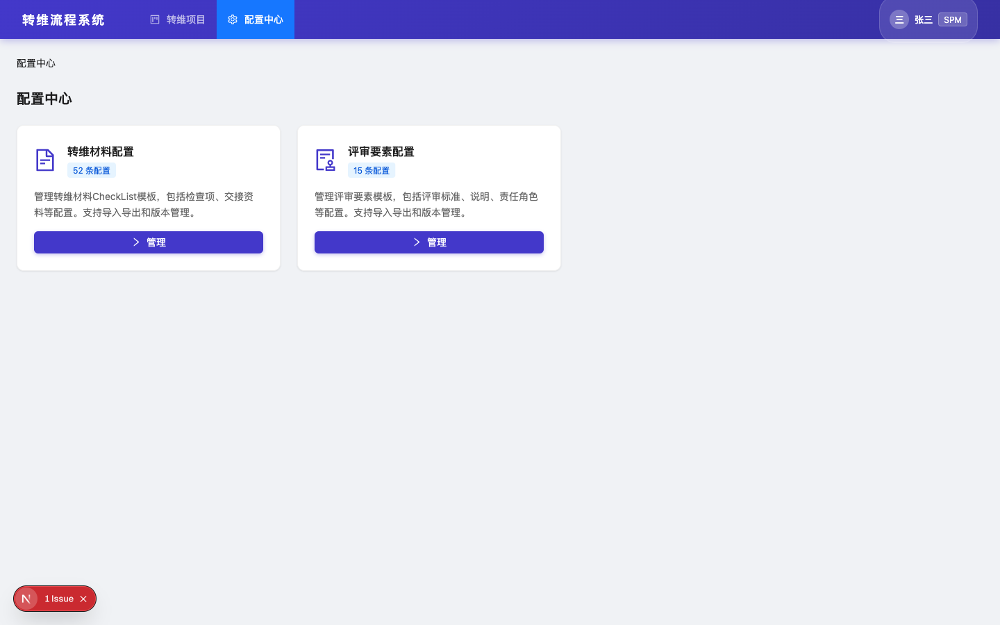

配置中心包含两个配置模块的入口卡片：
- **转维材料配置**: 管理52条CheckList模板
- **评审要素配置**: 管理15条评审要素模板

---

### 3.7 转维材料配置

**路由**: `/config/checklist`

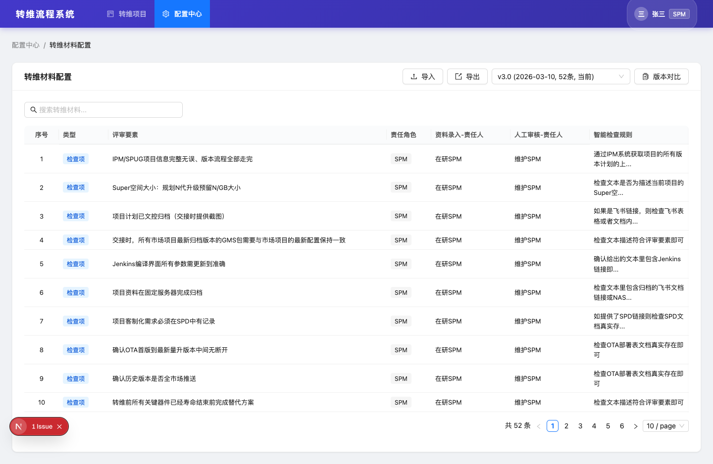

#### 3.7.1 表格字段

| 字段 | 说明 |
|------|------|
| 序号 | 自增序号 |
| 类型 | 检查项 / 交接资料 |
| 评审要素 | 检查项名称 |
| 责任角色 | SPM(25条) / 测试(11条) / 底软(11条) / 系统(5条) |
| 资料录入-责任人 | 在研团队对应角色描述 |
| 人工审核-责任人 | 维护团队对应角色描述 |
| 智能检查规则 | AI检查规则描述 |

#### 3.7.2 功能

- **搜索**: 按检查项名称模糊搜索
- **导入**: 支持 `.xlsx` / `.xls` 文件导入
- **导出**: 导出为Excel
- **版本管理**: 下拉切换历史版本
- **版本对比**: 弹窗对比两个版本的差异

---

### 3.8 评审要素配置

**路由**: `/config/review-elements`

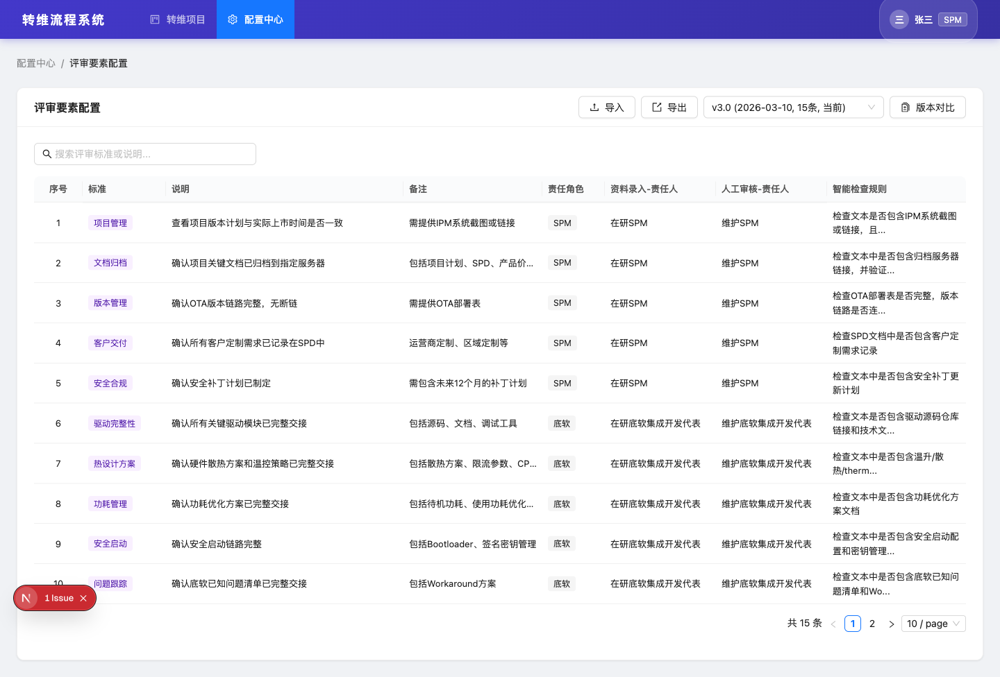

#### 3.8.1 表格字段

| 字段 | 说明 |
|------|------|
| 序号 | 自增序号 |
| 标准 | 评审标准分类 |
| 说明 | 评审要素详细描述 |
| 备注 | 补充说明 |
| 责任角色 | SPM(5条) / 底软(5条) / 系统(5条) |
| 资料录入-责任人 | 在研团队对应角色描述 |
| 人工审核-责任人 | 维护团队对应角色描述 |
| 智能检查规则 | AI检查规则描述 |

#### 3.8.2 功能

与转维材料配置相同：搜索、导入、导出、版本管理、版本对比。

---

## 四、状态机定义

### 4.1 流水线主节点状态

```
PipelineNodeStatus: not_started | in_progress | success | failed
```

### 4.2 角色子节点状态

```
RoleNodeStatus: not_started | in_progress | completed | rejected
```

### 4.3 录入状态

```
EntryStatus: not_entered → draft → entered
```

| 状态 | 标签 | 说明 |
|------|------|------|
| not_entered | 未录入 | 初始状态 |
| draft | 暂存 | 已输入内容但未提交 |
| entered | 已录入 | 已确认提交，触发AI检查 |

### 4.4 AI检查状态

```
AICheckStatus: not_started → in_progress → passed / failed
```

| 状态 | 标签 | 说明 |
|------|------|------|
| not_started | 未开始 | 尚未触发 |
| in_progress | 检查中 | AI正在检查 |
| passed | 通过 | AI检查通过 |
| failed | 不通过 | AI检查不通过，可点击查看原因 |

### 4.5 维护审核状态

```
ReviewStatus: not_reviewed → reviewing → passed / rejected
```

| 状态 | 标签 | 说明 |
|------|------|------|
| not_reviewed | 未审核 | 初始状态 |
| reviewing | 审核中 | 正在审核 |
| passed | 通过 | 审核通过 |
| rejected | 不通过 | 审核不通过，需创建Block任务 |

### 4.6 自动状态流转图

```
┌─────────────────────────────────────────────────────────────┐
│  创建申请                                                     │
│  ├── projectInit = success (自动)                             │
│  ├── dataEntry = in_progress                                  │
│  └── 4个角色 entryStatus = not_started                        │
├─────────────────────────────────────────────────────────────┤
│  任一角色录入任一条目                                           │
│  └── 该角色 entryStatus: not_started → in_progress            │
├─────────────────────────────────────────────────────────────┤
│  某角色所有条目 entered + AI passed                             │
│  └── 该角色 entryStatus: in_progress → completed              │
├─────────────────────────────────────────────────────────────┤
│  所有4个角色 entryStatus = completed                          │
│  ├── dataEntry = success                                      │
│  └── maintenanceReview = in_progress                          │
├─────────────────────────────────────────────────────────────┤
│  任一角色审核任一条目                                           │
│  └── 该角色 reviewStatus: not_started → in_progress           │
├─────────────────────────────────────────────────────────────┤
│  某角色所有条目审核通过                                         │
│  └── 该角色 reviewStatus: in_progress → completed             │
├─────────────────────────────────────────────────────────────┤
│  某角色任一条目审核不通过                                       │
│  └── 该角色 reviewStatus → rejected                           │
├─────────────────────────────────────────────────────────────┤
│  所有4个角色 reviewStatus = completed                         │
│  └── maintenanceReview = success → 进入信息变更                │
└─────────────────────────────────────────────────────────────┘
```

---

## 五、数据模型

### 5.1 转维申请 (TransferApplication)

| 字段 | 类型 | 说明 |
|------|------|------|
| id | string | 唯一标识 |
| projectId | string | 关联项目ID |
| projectName | string | 项目名称 |
| applicant | string | 申请人姓名 |
| applicantId | string | 申请人ID |
| team | ProjectTeam | 在研团队 + 维护团队 |
| plannedReviewDate | string | 计划评审日期 |
| remark | string | 备注 |
| status | PipelineStatus | in_progress / completed / cancelled |
| pipeline | PipelineState | 流水线状态 |
| createdAt | string | 创建时间 |
| updatedAt | string | 更新时间 |

### 5.2 CheckList条目 (CheckListItem)

| 字段 | 类型 | 说明 |
|------|------|------|
| id | string | 唯一标识 |
| applicationId | string | 关联申请ID |
| seq | number | 序号 |
| type | string | 检查项 / 交接资料 |
| checkItem | string | 检查项名称 |
| responsibleRole | PipelineRole | SPM / 测试 / 底软 / 系统 |
| entryPerson | string | 录入责任人姓名 |
| entryPersonId | string | 录入责任人ID |
| reviewPerson | string | 审核责任人姓名 |
| reviewPersonId | string | 审核责任人ID |
| aiCheckRule | string | AI检查规则 |
| entryContent | string | 录入内容文本 |
| entryStatus | EntryStatus | 录入状态 |
| aiCheckStatus | AICheckStatus | AI检查状态 |
| aiCheckResult | string | AI检查结果描述 |
| reviewStatus | ReviewStatus | 审核状态 |
| reviewComment | string | 审核意见 |
| delegatedTo | string[] | 被委派人ID列表 |

### 5.3 评审要素 (ReviewElement)

与CheckListItem结构类似，增加 `standard`（评审标准）、`description`（说明）、`remark`（备注）字段。

### 5.4 模板数据量

| 模板类型 | 总条数 | SPM | 测试 | 底软 | 系统 |
|---------|:---:|:---:|:---:|:---:|:---:|
| 转维材料CheckList | 52 | 25 | 11 | 11 | 5 |
| 评审要素 | 15 | 5 | 0 | 5 | 5 |

---

## 六、非功能需求

### 6.1 实时保存

- 资料录入（暂存/确认）操作实时保存到全局状态
- 维护审核（通过/不通过）操作实时保存到全局状态
- 状态变化实时反映在流水线进度上
- 页面跳转后数据不丢失

### 6.2 交付件智能识别

录入内容支持智能识别以下格式：
- `https://feishu.cn/docs/...` → 飞书文档（提取标题，显示图标）
- `https://feishu.cn/wiki/...` → 飞书知识库
- `https://feishu.cn/sheets/...` → 飞书表格
- `\\server\path\...` → Samba服务器路径（显示文件夹图标）
- 其他 `http(s)://...` → 通用链接（显示链接图标）

### 6.3 表格交互

- 操作栏固定在表格最右侧
- 水平滚动时操作栏不随内容移动
- 长文本字段支持 hover 提示
- 支持勾选多行批量操作

---

## 七、Mock数据说明（开发参考）

系统内置以下 mock 数据用于演示和开发验证：

| 申请ID | 项目名 | 状态 | 说明 |
|--------|--------|------|------|
| app-001 | X6870_H1234(Android16) | 进行中 | 资料录入阶段，各角色部分录入 |
| app-002 | X6768_H5678(Android15) | 进行中 | 维护审核阶段，全部录入完成 |
| app-003 | X6980_H9012(Android17) | 已取消 | 项目计划变更 |
| app-004 | X6650_H3456(Android14) | 已完成 | 全流程已完成 |

**当前登录用户**: 张三（SPM, u001）
- 在 app-001 中是在研SPM → 可录入
- 在 app-002 中是维护SPM → 可审核

---

## 八、待确认事项

| # | 问题 | 状态 |
|---|------|------|
| 1 | AI检查的具体对接方式和返回格式 | 待确认 |
| 2 | 信息变更节点的详细流程 | 待确认 |
| 3 | 用户认证对接方式（SSO/LDAP） | 待确认 |
| 4 | 文件附件上传是否需要支持（当前仅支持文本录入） | 待确认 |
| 5 | Block任务解除后的回退流程 | 待确认 |
| 6 | 历史版本模板的数据迁移策略 | 待确认 |
| 7 | 导入/导出的Excel格式规范 | 待确认 |
